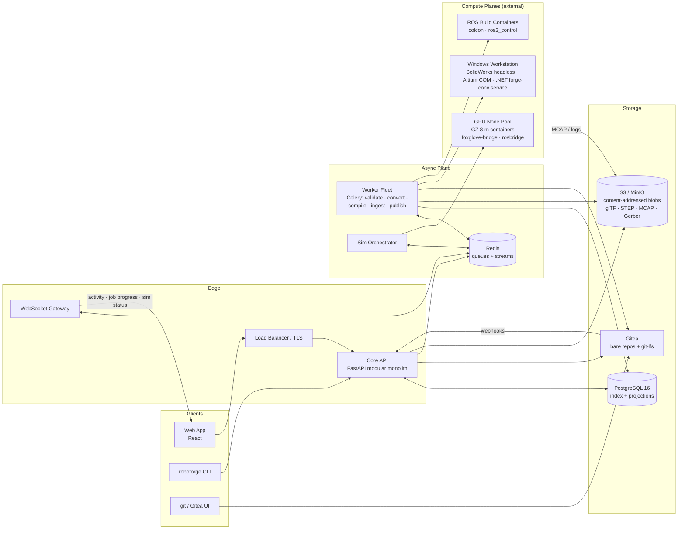
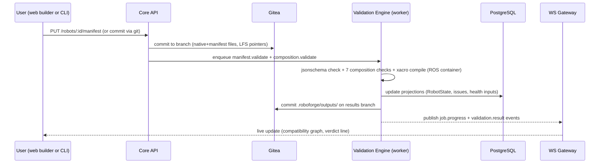
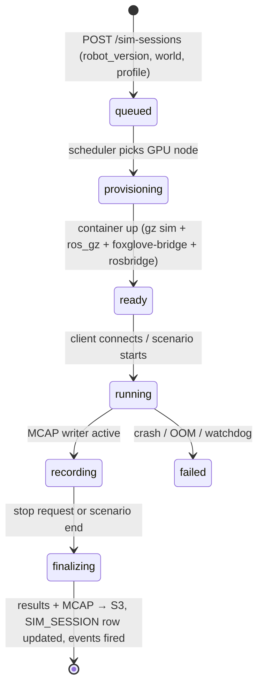

# RoboForge — Backend System Design

> Companion to `Frontend-Design.md`, `PRD.md`, and the schema family (`schemas/robot-manifest.schema.json`, `schemas/module-manifest.schema.json`, `schemas/composition.schema.json`).
> Covers: architecture, git-native storage model, services, database, API, async jobs, validation engine, simulation & CAD/EDA planes, real-time layer, auth/licensing, search, ops, and phase mapping.

---

## 1. Architectural Principles

Five decisions govern everything below. Each traces back to the research conclusions.

| # | Principle | Rationale |
|---|---|---|
| P1 | **Git is the source of truth; the database is an index** | The founding idea is "centralized state of the robot in a repository". Native files + manifests live in git (versioning, branching, diffs, blame for free — GitHub's own architecture: git + relational index). DB stores projections for query speed, never the canonical state. |
| P2 | **Modular monolith + worker fleet, not microservices** | Small team, unclear load. Heavy compute (sim, CAD conversion, xacro compile, validation) is naturally async anyway — so factor by *execution*, not by service. Hard external boundaries only where physics forces them: the Windows CAD workstation and the GPU sim pool. |
| P3 | **One backend language: Python** | The validation engine (jsonschema + 7 checks), ROS2/xacro tooling, colcon orchestration, and data ingestion are all Python-native. FastAPI keeps all of it in one deployable. (The SolidWorks/Altium plane is .NET/C# by necessity — see §10.) |
| P4 | **Schemas are the contract** | Every manifest write is validated against our three JSON Schemas at the API boundary (ajv-equivalent: `jsonschema`), server-side, on every commit. The frontend runs a TS port for instant feedback; the server is authoritative. |
| P5 | **Everything heavy is a job** | Any operation slower than ~2s (conversion, sim, compile, publish checks) runs through the async job system with retries, progress events, and audit trails. The API stays fast and idempotent. |

---

## 2. High-Level Architecture



**Three planes, one platform:**
1. **Control plane** — API + DB + git + object storage (fast, synchronous, CRUD-ish).
2. **Async plane** — queues, workers, orchestrators (slow, retryable, eventful).
3. **Compute planes** — GPU sim pool and Windows CAD/EDA workstation (specialized hardware, pulled from queues, never exposed inbound).

---

## 3. Robot Repository Model (the heart)

Each robot is a git repo. Gitea is embedded as the git plane (gives us commit history, branches, diffs, and the *Recent Commits* / *Project Stats* panels in the frontend for free).

### 3.1 Canonical repo layout

```
robot.yaml                         # robot manifest (schemas/robot-manifest.schema.json)
compositions/
  mini-leg.composition.json        # compositions (authored sections only)
mechanical/
  cad/                             # SolidWorks native files → git-lfs
  drawings/
electrical/
  altium/                          # PCB project → git
software/
  ros2/                            # or git submodule link
simulation/
  worlds/
  profiles/
testing/
  materials/
docs/
.roboforge/
  outputs/                         # computed: xacro, urdf, bom, wiring, reports (generated, read-only)
```

`.roboforge/outputs/` is **engine-written only** — the authored/computed split from the composition schema, enforced physically (CI check: no manual commits touching it).

### 3.2 Write path (manifest-as-code)



### 3.3 Versioning model

- **Working state** = a branch. The dashboard's "branch: main" is literal.
- **Robot version** = an annotated **git tag** (semver) + an immutable `ROBOT_VERSION` row snapshotting the resolved manifest (`manifest_yaml` in the ER model).
- **Module versions** in the registry are **immutable once published** (npm semantics — `MODULE_VERSION (module_id, semver)` unique; no republish, only yank). Compositions pin exact versions, per the composition schema.
- **Artifacts** are content-addressed: native files via git-lfs (dedup by sha256), large derivatives (glTF, STEP, MCAP, PDF) in S3 keyed `sha256:<hash>`. The `DERIVATIVE` table maps artifact_version → object key → status.

---

## 4. Bounded Contexts (monolith modules)

The monolith is split into import-boundary-enforced packages (enforced by lint, one DB schema per context):

| Context | Owns | Key tables |
|---|---|---|
| `identity` | orgs, users, memberships, API tokens, RBAC | ORGANIZATION, USER, MEMBERSHIP |
| `projects` | projects, robots, versions, tags | PROJECT, ROBOT, ROBOT_VERSION |
| `artifacts` | artifact registry, LFS pointers, derivatives, conversion jobs | ARTIFACT, ARTIFACT_VERSION, DERIVATIVE |
| `registry` | module publishing, versions, interface index, substitutes | MODULE, MODULE_VERSION, INTERFACE, INTERFACE_KIND |
| `composition` | compositions, validation runs, outputs | COMPOSITION (+ validation results in JSONB) |
| `simulation` | sim profiles, session lifecycle, streaming tokens, MCAP refs | SIM_SESSION |
| `builds` | ROS/CI builds, build graph, commits projection | BUILD, TEST_RUN |
| `materials` | materials, batches, specimens, tests, results | MATERIAL, BATCH, SPECIMEN, TEST, TEST_RESULT |
| `publishing` | open-source flow, license checks, OSHWA, marketplace | PUBLICATION, LICENSE |
| `search` | cross-entity index for ⌘K | search_index (own) |
| `events` | outbox, activity timeline, notifications | outbox, EVENT |

---

## 5. Database Design

PostgreSQL 16. Relational projection of git state + JSONB for schema-validated documents. Consistent with the Project-Report ER (Fig. 6); representative DDL:

```sql
-- projects context
CREATE TABLE robot (
  id            uuid PRIMARY KEY DEFAULT gen_random_uuid(),
  project_id    uuid NOT NULL REFERENCES project(id),
  slug          text NOT NULL,                      -- kebab-case, unique per project
  name          text NOT NULL,
  category      text NOT NULL,
  visibility    text NOT NULL DEFAULT 'private',    -- private | unlisted | public
  repo_path     text NOT NULL,                      -- gitea: org/repo.git
  created_at    timestamptz NOT NULL DEFAULT now(),
  UNIQUE (project_id, slug)
);

CREATE TABLE robot_version (
  id            uuid PRIMARY KEY DEFAULT gen_random_uuid(),
  robot_id      uuid NOT NULL REFERENCES robot(id),
  semver        text NOT NULL CHECK (semver ~ '^\d+\.\d+\.\d+'),
  commit_sha    text NOT NULL,                      -- the git tag target
  manifest      jsonb NOT NULL,                     -- resolved snapshot (immutable)
  status        text NOT NULL DEFAULT 'draft',      -- draft | validated | released
  created_by    uuid REFERENCES "user"(id),
  created_at    timestamptz NOT NULL DEFAULT now(),
  UNIQUE (robot_id, semver)
);

-- registry context: immutable published modules
CREATE TABLE module_version (
  id            uuid PRIMARY KEY DEFAULT gen_random_uuid(),
  module_id     uuid NOT NULL REFERENCES module(id),
  semver        text NOT NULL,
  manifest      jsonb NOT NULL,     -- validated vs module-manifest.schema.json
  yanked        boolean NOT NULL DEFAULT false,
  published_at  timestamptz NOT NULL DEFAULT now(),
  UNIQUE (module_id, semver)
);
CREATE INDEX ON module_version USING gin (manifest);          -- interface queries
CREATE INDEX ON module_version (module_id, published_at DESC);

-- GIN index powering the builder's compatibility search:
-- find modules whose mechanical interfaces bolt_pattern matches a target
CREATE INDEX module_iface_idx ON module_version
  USING gin ((manifest -> 'mechanical' -> 'interfaces') jsonb_path_ops);

-- composition context
CREATE TABLE composition (
  id                uuid PRIMARY KEY DEFAULT gen_random_uuid(),
  robot_id          uuid NOT NULL REFERENCES robot(id),
  branch            text NOT NULL DEFAULT 'main',
  doc               jsonb NOT NULL,          -- authored sections (composition.schema.json)
  validation        jsonb,                   -- computed: checks[], status, outputs refs
  updated_at        timestamptz NOT NULL DEFAULT now()
);

-- materials context: stats computed on query, never stored
CREATE TABLE test_result (
  id         uuid PRIMARY KEY DEFAULT gen_random_uuid(),
  test_id    uuid NOT NULL REFERENCES test(id),
  property   text NOT NULL,
  value      double precision NOT NULL,
  unit       text NOT NULL,
  specimen_id uuid NOT NULL REFERENCES specimen(id)
);
CREATE INDEX ON test_result (property, value);

-- events context: transactional outbox (P1: events never lost, never orphaned)
CREATE TABLE outbox (
  id          bigserial PRIMARY KEY,
  aggregate    text NOT NULL,          -- e.g. 'robot:uuid'
  event_type  text NOT NULL,           -- e.g. 'validation.completed'
  payload     jsonb NOT NULL,
  created_at  timestamptz NOT NULL DEFAULT now(),
  dispatched  boolean NOT NULL DEFAULT false
);
```

**Design rules:**
- Manifests are stored as **validated JSONB** — schema-validated at write, GIN-indexed for interface/compatibility queries; normalized projections only where relational joins are needed (module registry, materials, versions).
- Everything the frontend shows per panel has a direct projection: Robot State card ← `robot_version.status` + systems from manifest JSONB; Recent Issues ← `composition.validation`; Activity Timeline ← `outbox` → `EVENT` table.
- **Immutable rows are never updated** (`robot_version`, published `module_version`) — history is append-only; corrections are new rows/tags.
- **Statistics computed on query** from `TEST_RESULT` (n/mean/std per material family) — no stale aggregates.

---

## 6. API Design

REST, OpenAPI 3.1 auto-generated (FastAPI), cursor pagination, `Idempotency-Key` on all POSTs that enqueue work, ETags on manifest reads.

### 6.1 Resource map

```
# identity
POST   /v1/auth/token                     # OIDC exchange → platform JWT
GET    /v1/orgs/:org/projects

# robots & versions
POST   /v1/robots                          # creates repo + manifest stub
GET    /v1/robots/:id
PUT    /v1/robots/:id/manifest             # commit manifest (triggers validation jobs)
GET    /v1/robots/:id/versions
POST   /v1/robots/:id/releases             # tag semver → immutable robot_version

# compositions (the builder backend)
POST   /v1/robots/:id/compositions/validate   # run engine, return computed sections (no write)
PUT    /v1/robots/:id/compositions            # persist authored doc + computed results
GET    /v1/robots/:id/compositions/:cid/outputs/xacro   # served from .roboforge/outputs or S3

# module registry
GET    /v1/modules?q=&category=&mate=&voltage=   # builder library search (GIN-backed)
POST   /v1/modules/:id/versions              # publish (immutable; schema-validated; hardware license REQUIRED)
POST   /v1/modules/:id/versions/:v/yank

# artifacts & derivatives
POST   /v1/artifacts/upload-urls            # presigned S3/LFS batch
POST   /v1/artifacts/:id/derivatives         # enqueue conversion (STEP, glTF, Gerber, BOM, PDF)
GET    /v1/artifacts/:id/derivatives/:kind   # status + download URL

# simulation
POST   /v1/sim-sessions                     # { robot_version, world, profile, gpu_class }
GET    /v1/sim-sessions/:id                 # status + endpoints
GET    /v1/sim-sessions/:id/foxglove-ws     # signed WS URL (topics: /see §8)
GET    /v1/sim-sessions/:id/novnc           # signed noVNC URL (Gazebo GUI)
GET    /v1/sim-sessions/:id/recordings      # MCAP list + download URLs
POST   /v1/sim-sessions/:id/stop

# builds, tests, materials
POST   /v1/builds                           # enqueue colcon build (container) → Build Graph
POST   /v1/test-runs                        # ingest results (unit/integration/sim/hil/field)
POST   /v1/materials/ingest                 # machine files / CSV → MATERIAL…TEST_RESULT

# publishing
POST   /v1/robots/:id/publish               # license check → PUBLICATION (+ optional OSHWA)

# search & realtime
GET    /v1/search?q=&kinds=robots,modules,files,commits,commands
WS     /v1/ws?channels=robot:{id},job:{id},sim:{id}
```

### 6.2 Validation endpoint contract

`POST /compositions/validate` returns **exactly** the computed sections of the composition schema — `validation` (7 named checks with `pass/warn/fail/skipped` + messages) and `outputs` refs — so the frontend's compatibility graph, verdict line, and inspector checklist render one API response with zero translation. This is the authored/computed split expressed as an API boundary.

---

## 7. Async Job System

Redis-backed queues (Celery v1 → dedicated orchestrators where needed). All jobs share one state machine and publish progress to the WS gateway via the outbox.

### 7.1 Job catalog

| Job | Queue | Runs where | Typical time | Produces |
|---|---|---|---|---|
| `manifest.validate` | cpu | worker | <1s | schema verdict |
| `composition.validate` | cpu | worker | <2s | 7 checks, computed sections |
| `xacro.compile` | ros | ROS2 container | 5–60s | urdf/srdf, compile log |
| `build.ros` | ros | ROS2 container | 1–15min | colcon build graph + artifacts |
| `cad.convert` (STEP/PDF) | windows | SolidWorks workstation | 30s–10min | derivatives |
| `cad.gltf` | windows | workstation (or headless mesh pipeline) | 1–5min | assembly glTF for viewport |
| `eda.outputs` (Gerber/BOM/netlist) | windows | Altium COM worker | 10–60s | derivatives |
| `eda.render` | cpu | tracespace (self-hosted) | seconds | PCB viewer assets |
| `sim.run` | gpu | GZ Sim container (GPU pool) | minutes–hours | MCAP, metrics, test verdicts |
| `materials.ingest` | cpu | worker | seconds | MATERIAL/BATCH/SPECIMEN/TEST rows |
| `publish.checks` | cpu | worker | seconds | license report, OSHWA submission |
| `search.reindex` | cpu | worker | seconds | search_index updates |

### 7.2 State machine & guarantees

```
queued → leased → running → succeeded
                        ↘ failed → retry (exp. backoff, max 3) → dead-letter
        cancelled ↖ (user/timeout anywhere before running)
```
- **Idempotent by job key** (`artifact_version + derivative_kind`) — retries never double-convert.
- **Heartbeats + leases**: worker crash ⇒ lease expires ⇒ re-queued.
- **Progress events** at 0/25/50/75/100 for long jobs → WS `job:{id}` channel → frontend progress UI.
- **Dead-letter queue** with UI surfacing (Recent Issues feed includes failed jobs).

---

## 8. Simulation Plane

The most operationally distinctive part; built on the research conclusion (GZ Sim + ros_gz + ros2_control, containerized, browser via noVNC/WebRTC + Foxglove/MCAP).

**Session lifecycle:**



- **Container image**: `gzsim-harmonic` + `ros-gz` + `ros2_control` + `foxglove_bridge` + `rosbridge` — built from the robot version's pinned `simulation.robot_description` (xacro → compiled urdf/sdf injected at launch).
- **Streaming**: foxglove-bridge exposes topics (JointState, odometry, TF, sensors) over signed WebSocket URLs → embedded Foxglove panel ("Open in RViz"-grade view); Gazebo GUI via noVNC (WebRTC tier later, requires SFU — LiveKit/Janus).
- **Recording**: every session MCAP-records to S3; `SIM_SESSION` carries refs → playback in Foxglove later (regression evidence).
- **Quotas**: per-plan concurrency + GPU class (`gpu_class: t4 | a10g | none` for CPU-only worlds); watchdog kills on OOM.
- **Scheduling**: v1 = single GPU host + compose with a fixed slot count; v2 = K8s Job per session on a GPU node pool, bin-packed by class.

---

## 9. Validation Engine Service

The Python package that consumes all three schemas — the same engine the frontend gets via `/compositions/validate`.

```
roboforge_engine/
  schema.py          # load 3 JSON Schemas (draft 2020-12), validate + collect precise paths
  registry.py        # module resolution: (module_id, version) → manifest (DB/Gitea-backed)
  checks/
    mate_matching.py     # bolt pattern / pilot / load rating vs module interfaces
    load_rating.py       # moment/axial limits per mated interface
    collision.py         # coarse collision via glTF AABB/SAT (v1: bounding boxes)
    power_budget.py      # provides_w vs peak draw, voltage ranges, duty derating
    bus_config.py        # protocol/baud match, topology limits, node_id collisions
    software_interfaces.py  # topic/type/QoS compatibility across software_links
    xacro_compile.py     # compose macros w/ params → xacro → urdf (ROS2 sidecar)
  licenses.py        # per-domain license intersection → conflicts[]
  outputs.py         # emit xacro/bom/wiring/power_report/license_report refs
```

- **Deterministic & pure**: given (composition doc, registry snapshot, pinned versions), output is reproducible → results are cacheable by content hash and auditable per robot version.
- **Runs in two modes**: full validation job (async, writes computed sections) and preview (sync API, <2s budget, skips `xacro_compile` — marked `skipped`).
- The 7 check names in the code are **exactly** the enum in `composition.schema.json` — no translation layer.

---

## 10. CAD/EDA Integration Plane (Windows workstations)

SolidWorks and Altium have no public REST APIs and need licensed Windows hosts — they become **pull-based workers** on the async plane (outbound connection to Redis over TLS; no inbound ports, no VPN).

**Workstation service ("forge-conv", .NET 8):**
- Leases jobs from the `windows` queue (Redis), executes, uploads results to S3, commits LFS/git pointers back through the API.
- **SolidWorks**: headless conversion via installed SolidWorks (export STEP/PDF/glTF); metadata + mass properties via the free **Document Manager API** (no interactive license needed for the metadata path — cheap bulk indexing). xCAD.NET remains the fallback if licensing headless seats proves prohibitive.
- **Altium**: PCB project stored natively in git; outputs (Gerber, BOM, netlist) via **COM automation**; **A365 REST** when the org has Altium 365; **tracespace** self-hosted renders viewer assets for the web.
- **Licensing guard**: job types are enabled per workstation based on detected seats; the queue never routes a SolidWorks job to an Altium-only box.
- Multiple workstations scale the fleet horizontally; one license = one slot; nightly health checks.

---

## 11. Real-time Layer

- **Transactional outbox** (§5) → Redis Streams consumer → **WebSocket gateway** (separate process, scaled horizontally behind the LB). No event is published inside a request handler — events are committed with the data, then relayed. This keeps the Activity Timeline and job progress consistent with the DB.
- **Channels**: `robot:{id}` (activity, validation results, health), `job:{id}` (progress), `sim:{id}` (session status + endpoint URLs), `org:{id}` (presence/notifications).
- **ROS live topics are NOT on this gateway** — they stream via the foxglove bridge directly from the sim container (signed URLs), keeping high-frequency topic traffic off the app plane.
- Fan-out with rate limiting per connection; events are small JSON (domain icon + text + deep link) matching the timeline component shape.

---

## 12. Auth, Permissions & Licensing

- **AuthN**: OIDC (self-hosted Zitri/Keycloak, or hosted Auth0/Clerk in SaaS mode) → platform JWTs (short-lived) + refresh; **API tokens** (scoped, per-org) for CLI/CI.
- **RBAC**: org roles (`owner/admin/member/viewer`) + per-robot ACLs; branch-level push rules mirror Gitea permissions (write = commit manifests, maintainer = release/publish).
- **Public sharing**: `publication` flow is the *only* path to public — server re-validates, requires licenses (mirrors the schema's if/then: public ⇒ hardware/software/docs licenses), generates the license report, optionally files **OSHWA** certification, then flips visibility and snapshots.
- **License intersection**: composition engine computes conflicts across module hardware licenses (CERN-OHL vs proprietary etc.) → surfaced in UI and **blocking** on publish, warning-only in draft.
- **SBOM**: releases auto-generate CycloneDX (software packages from the robot manifest + ROS deps from the build).

---

## 13. Search & Command Palette

The ⌘K bar searches robots, modules, files, commits, and commands across org boundaries.

- v1: **Postgres FTS + trigram** (`search_index` table: `kind, org_id, title, subtitle, url, tsv, trgm`) — one index, GIN-backed, updated by the outbox consumer. Zero new infra.
- v2 (scale): swap the same interface to Typesense/Meilisearch with scoped API keys per org. The API contract (`/v1/search?q=&kinds=`) doesn't change.

---

## 14. Observability & Operations

- **Logs**: structured JSON everywhere (API, workers, workstation agent, sim containers) → Loki; trace ids propagated through queue hops.
- **Tracing**: OpenTelemetry across API → queue → worker → S3/git writes; sampling on by default.
- **Metrics** (Prometheus): queue depth per type, job duration histograms (CAD convert is the SLO-sensitive one), sim slot utilization, GPU pool saturation, validation latency, WS connections.
- **Health**: `/healthz` (liveness), `/readyz` (DB + Redis + Gitea reachable); workstation heartbeats + last-seen drive the "Environments Ready/Offline" strip.
- **Backups**: nightly `pg_dump` + S3 versioning; git repos are re-clonable from Gitea mirrors; LFS objects deduped by hash in S3 with lifecycle rules.
- **Sentry** for exceptions with release tagging per deploy.

---

## 15. Deployment Topology

**Dev (docker-compose)** — one command up:
`api`, `worker`, `ws-gateway`, `postgres`, `redis`, `minio`, `gitea`, `tracespace`, one `gzsim` container (CPU), `loki/grafana`. Windows workstation optional via Vagrant/VirtualBox with the forge-conv agent pointed at the compose Redis.

**Prod (Kubernetes)**:
- **Web tier**: API ×N + WS gateway ×N behind LB (HPA on RPS / connections).
- **Worker tier**: `cpu` pool (HPA on queue depth), `ros` pool (container builds), `gpu` node pool for sim sessions (K8s Job per session, taint `gpu=true`).
- **External**: Windows workstations as **bare-metal pull agents** (no cluster membership), S3 + Postgres managed or self-hosted per deployment mode.
- Deploy mode ambiguity (from PRD open questions) is preserved: the same images run the SaaS and a self-hosted single-box bundle.

---

## 16. Security

- **Secrets**: SOPS/Vault; DB/Redis/S3 creds never in images; workstation agent holds only its enrollment token.
- **Uploads**: antivirus pass on artifact upload; size + type allowlists per domain; LFS pointer integrity (sha256 verified on every fetch).
- **SSRF-safe webhooks**: egress allowlist for Gitea/A365 integrations.
- **Isolation**: per-org S3 prefixes + signed URLs (short TTL); sim containers run with no cloud credentials — they only write back through the orchestrator.
- **Rate limits** per token + per IP on validation/search endpoints (they're the expensive ones).
- **Audit**: every publish, release, and permission change lands in `EVENT` (append-only) → audit page.

---

## 17. Scaling Path & Phase Mapping

| Roadmap | Backend scope | Notes |
|---|---|---|
| M0 | Repo scaffolding, schemas, compose stack, CI | engine skeleton + schema tests (already drafted) |
| M1 Core | identity, projects, robots, manifest CRUD, git plane, versions, activity (outbox→WS) | the Overview dashboard (read path) goes live |
| M2 Software | builds (colcon in containers), commits projection, test-run ingest, search v1 | Timeline, Build Graph, Test donut |
| M3 Builder | registry (immutable publish), composition engine + `/validate`, xacro sidecar | the flagship screen's backend |
| M4 Mechanical | forge-conv workstation, Document Manager indexing, STEP/glTF derivatives | 3D viewport gets real meshes |
| M5 Electrical | Altium COM outputs, tracespace derivatives, BOM linkage | |
| M6 Materials | ingest pipeline + stats-on-query APIs | |
| M7 Simulation | sim orchestrator, GPU pool, foxglove/noVNC streaming, MCAP lake | hardest ops surface — kept late on purpose |
| M8 Publishing | publish flow, license engine, OSHWA, marketplace, public registry | |
| M9 Hardening | HA Postgres, read replicas, cache layer, load tests, multi-workstation fleets | |

**Deliberate sequencing**: everything through M3 runs on a single box; the two expensive planes (GPU sim, Windows fleet) arrive only when their product phase demands them.

---

## 18. Key Risks & Open Decisions

| Risk | Mitigation |
|---|---|
| SolidWorks headless license cost/legality | Document Manager API covers the free path (metadata/mass props); conversion capacity sized to one seat initially; xCAD.NET as escape hatch |
| GPU sim cost | quotas + CPU-only worlds first; sessions are ephemeral by design |
| Gitea coupling | isolate git access behind a thin `GitPlane` interface (bare-repo backend possible later) |
| LFS repo bloat | content-addressed S3 derivatives kept out of git; lifecycle rules |
| Worker fleet ops on Windows | pull-based agents, heartbeats, one golden AMI/image |

**Open decisions:** managed vs self-hosted Postgres/S3 in SaaS mode; Foxglove WebSocket vs rosbridge as primary live protocol; Celery vs lighter Arq/RQ for v1; when to introduce NATS between outbox and WS gateway.
