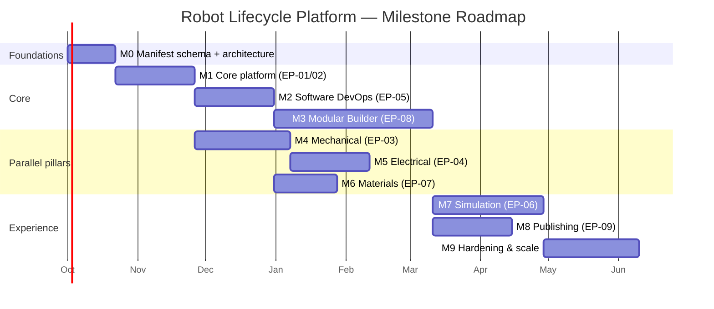

# Product Requirements Document (PRD)

## Centralized Robot Lifecycle Platform

| Field | Value |
|---|---|
| Document version | 1.0 |
| Date | 2026-09-25 |
| Status | Draft for research / planning |
| Related artifacts | `Project-Report.md` (technical report), `Project-Mindmap.md` (mind map) |

---

## 1. Executive Summary

### 1.1 Problem

Robot development spans five domains — mechanical (SolidWorks), electrical (Altium), software (ROS 2), simulation (Gazebo/RViz/MoveIt/Unity), and material testing — each living in a different tool with no shared, versioned state. Impact analysis across domains is manual; module reuse requires hand-verifying mechanical, electrical, and software compatibility; simulation setups drift from design data; material test results are disconnected from the parts they qualify; and the open-hardware community lost its central sharing platform (Wikifactory) with no successor.

### 1.2 Vision

**One versioned source of truth for every robot — from first CAD sketch to open-source release.** A platform where the mechanical assembly, the PCBs, the ROS 2 packages, the simulation models, and the test records of a robot are linked into a single traceable graph, where prebuilt modules can be drag-and-drop composed into new robots with automated compatibility validation, and where complete robots can be published open-source with proper per-artifact licensing.

### 1.3 Product Goals

| ID | Goal |
|---|---|
| G1 | Centralize: one repository holds mechanical, electrical, software, simulation, and test artifacts with a versioned Robot Manifest as the source of truth |
| G2 | Integrate: first-class connectors for SolidWorks and Altium (upload, versioning, BOM, in-browser viewing, diffing) |
| G3 | Automate: ROS 2 build/test pipelines and simulation-in-CI driven by the same robot descriptions used on hardware |
| G4 | Simulate centrally: browser-accessible Gazebo/MoveIt/RViz (and optional Unity) environments per robot |
| G5 | Trace: material batches → specimens → tests → results → CAD part revisions → FEA material cards |
| G6 | Compose: drag-and-drop modular robot builder with automated mechanical/electrical/software compatibility validation and code generation |
| G7 | Share: public open-source publishing of complete robots/modules with per-artifact licensing and license-conflict detection |

### 1.4 Non-Goals (v1)

- Real-time fleet management / telemetry from deployed robots
- Commerce / paid marketplace
- Proprietary CAD or EDA authoring tools (we integrate, not replace)
- AI-based design generation (future scope)

---

## 2. Personas

| Persona | Toolchain | Top needs |
|---|---|---|
| **Mechanical Engineer** | SolidWorks, PDM | Check in assemblies without friction; view versions in browser; see BOM/mass changes |
| **Electronics Engineer** | Altium Designer / Altium 365 | Version schematics/PCBs; Gerber review in browser; ECAD-MCAD sync |
| **Robotics Software Engineer** | ROS 2, Git, Gazebo, MoveIt | One-click CI; shared sim environments; test results tied to robot versions |
| **Test Engineer** | Instron/Zwick machines, spreadsheets | Record material tests; link results to parts; export FEA cards |
| **Project Lead** | Everything (read-only) | Traceability queries; release gates; license compliance overview |
| **Public User / Contributor** | Browser | Discover, fork, and legally reuse published robots and modules |

---

## 3. Epics and Requirements

Priority legend: **P0** = MVP-critical · **P1** = core platform · **P2** = differentiators/scale

### EP-01 — Identity, Organizations & Access Control (P0)

**Goal:** multi-user collaboration foundation.

- **US-01.1** — As a user, I want to sign up with email/OAuth (Google/GitHub) so that I can access the platform.
- **US-01.2** — As an org admin, I want to create an organization and invite members with roles (viewer / editor / admin) so that access is controlled.
- **US-01.3** — As an editor, I want per-project permissions so that contractors can see only assigned projects.

**Acceptance criteria:** OIDC login works; RBAC enforced on all API endpoints; audit log records permission changes.

### EP-02 — Projects, Robot Manifest & Versioning (P0)

**Goal:** the centralized state — the heart of the product.

- **US-02.1** — As a project lead, I want to create a robot project with a manifest (mechanical / electrical / software / simulation / testing sections) so that all domains are represented in one place.
- **US-02.2** — As an engineer, I want to check out binary files (CAD/PCB) with locks so that concurrent edits on unmergeable files are prevented.
- **US-02.3** — As an engineer, I want version history with diffs (BOM deltas, mass-property deltas, side-by-side renders) so that I can review what changed.
- **US-02.4** — As a project lead, I want a traceability graph (part ↔ board ↔ node ↔ URDF ↔ test ↔ module) so that impact of any change is visible.
- **US-02.5** — As an engineer, I want manifests validated against the schema on save so that broken references are caught early.

**Acceptance criteria:** manifest CRUD + validation; lock/unlock flow with lease expiry; diff view shows BOM/mass deltas for CAD versions; graph API answers "what does X affect?" queries.

### EP-03 — Mechanical Domain (SolidWorks) (P0)

**Goal:** git-like workflow for SolidWorks without re-implementing PDM.

- **US-03.1** — As a mechanical engineer, I want a SolidWorks add-in to upload/check-in assemblies with all references resolved so that the full design is stored intact.
- **US-03.2** — As a reviewer, I want automatic STEP/glTF derivatives with a three.js web viewer so that I can review designs without SolidWorks installed.
- **US-03.3** — As a mechanical engineer, I want BOM, references, and mass properties extracted automatically (Document Manager API) so that weight and part lists are always current.
- **US-03.4** — As a mechanical engineer, I want stale derivatives flagged when the native file changes so that I never review outdated geometry.

**Acceptance criteria:** add-in (xCAD.NET) working; DocMgr indexer runs on upload; conversion worker queues SolidWorks exports; viewer loads a 100-part assembly derivative in <3 s.

### EP-04 — Electrical Domain (Altium) (P1)

**Goal:** versioned electronics with web review and ECAD-MCAD linkage.

- **US-04.1** — As an electronics engineer, I want Altium project sync via native git (one repo per PCBA) so that schematics/PCBs are versioned like code.
- **US-04.2** — As an electronics engineer, I want in-browser Gerber rendering (tracespace) with BOM-to-board highlighting so that I can review boards without Altium.
- **US-04.3** — As an electronics engineer, I want IDX/CoDesigner exchange files stored as versioned artifacts so that ECAD-MCAD sync state is tracked and conflicts surface loudly.

**Acceptance criteria:** git sync both directions; Gerber viewer renders layers with toggles; IDX artifact type appears in manifest and diff views.

### EP-05 — Software DevOps for Robots (P0)

**Goal:** verified robot software, continuously.

- **US-05.1** — As a software engineer, I want hosted git repos with ROS 2 CI pipelines (vcs import → rosdep → colcon build/test) so that every commit is verified.
- **US-05.2** — As a software engineer, I want simulation-in-CI tests (launch_testing + Gazebo headless + ros2_control mock/gazebo interfaces) so that behavior is tested without hardware.
- **US-05.3** — As a software engineer, I want one-click devcontainers (ROS 2 Jazzy image) so that onboarding takes minutes.
- **US-05.4** — As a project lead, I want build/test status badges on the robot page so that quality is visible at a glance.

**Acceptance criteria:** CI pipeline runs on push; colcon logs stored as artifacts; same URDF + controllers run in CI and sim environments.

### EP-06 — Simulation Environments (P1)

**Goal:** centralized, browser-accessible simulation driven by the same robot descriptions.

- **US-06.1** — As an engineer, I want to launch Gazebo Sim / MoveIt / RViz sessions from the robot page and interact via WebRTC/noVNC streaming so that no local setup is needed.
- **US-06.2** — As an engineer, I want topic visualization and MCAP recording/replay (Foxglove) so that results are inspectable and shareable.
- **US-06.3** — As an engineer, I want a Unity visualization tier (ROS-TCP-Connector + URDF Importer) for photoreal previews of the same robot model.
- **US-06.4** — As an admin, I want CPU/GPU session profiles with metering so that costs are controlled.

**Acceptance criteria:** session lifecycle (launch/suspend/terminate); stream latency acceptable for teleop (<200 ms); GPU sessions on demand, CPU fallback for logic tests.

### EP-07 — Material Testing (P1)

**Goal:** traceable material data feeding design and FEA.

- **US-07.1** — As a test engineer, I want to register materials, batches/lots (with COA attachments), and specimens so that physical traceability is captured.
- **US-07.2** — As a test engineer, I want CSV upload from Instron/Zwick exports parsed into typed results (ASTM E8/E23/E466 vocabulary, explicit units) so that no manual transcription happens.
- **US-07.3** — As a mechanical engineer, I want results linked to CAD part revisions and exported as ANSYS/Abaqus material cards so that FEA uses tested data.
- **US-07.4** — As a project lead, I want on-demand statistics (n, mean, std) per property so that design allowables are evidence-based.

**Acceptance criteria:** CSV ingestion with unit normalization; stress-strain curve storage/plotting; traceability links (test ↔ part revision ↔ FEA card); report export.

### EP-08 — Modular Robot Builder (P0, flagship)

**Goal:** drag-and-drop composition of prebuilt modules with automated validation.

- **US-08.1** — As a module author, I want to publish a module with a manifest (mechanical interfaces, electrical buses/power, ROS 2 interfaces, xacro fragment) so that the platform understands it.
- **US-08.2** — As a designer, I want a module registry searchable by interface tags (bolt patterns, bus protocols, topic types) so that I find compatible modules fast.
- **US-08.3** — As a designer, I want a drag-and-drop canvas where modules snap at compatible mates with live feedback so that I can compose robots visually.
- **US-08.4** — As a designer, I want automated validation — mate matching, static collision, power budget, bus/node-ID conflicts, topic/QoS matching, and a real xacro compile — so that I catch mistakes before hardware exists.
- **US-08.5** — As a designer, I want generated outputs — composed URDF/xacro, consolidated BOM, wiring table, power report, license-intersection report — so that the composition is buildable.
- **US-08.6** — As a designer, I want compositions saved as new robot versions in the manifest so that they flow into CI and simulation automatically.

**Acceptance criteria:** manifest schema validation on publish; all 7 validation checks run in <10 s per composition; generated xacro compiles clean; BOM/wiring/power reports downloadable.

### EP-09 — Open-Source Publishing (P1)

**Goal:** the "GitHub for complete robots" layer.

- **US-09.1** — As an author, I want to publish a robot/module with per-artifact licenses (CERN-OHL-P/S for hardware, MIT/Apache for code, CC-BY-SA for docs) so that reuse terms are unambiguous.
- **US-09.2** — As an author, I want an OSHWA-aligned release checklist (editable sources mandatory, not just STLs) so that my project qualifies as open hardware.
- **US-09.3** — As a public user, I want to fork/download complete bundles with license metadata preserved so that I can legally build on them.
- **US-09.4** — As a designer, I want license-intersection warnings when composing modules so that I don't mix incompatible licenses unknowingly.

**Acceptance criteria:** license editor per artifact domain; discovery/search with license filters; license report included in every composition output.

---

## 4. Non-Functional Requirements

| Category | Requirement |
|---|---|
| Performance | 3D viewer <3 s for 100-part assemblies; diffs <5 s; composition validation <10 s |
| Security | OIDC/OAuth2, RBAC, signed storage URLs, secrets vault for CI, SOC2-tracked audit log |
| Scalability | Stateless API + queue-driven workers (horizontal); object storage (MinIO/S3); multi-tenant data isolation |
| Availability | Web tier 99.5%; async workers with retry/backoff; graceful degradation of sim under load |
| Interoperability | URDF/xacro/SDF/SRDF, STEP/Parasolid, Gerber/ODB++, IDX, MCAP, CSV (Instron/Zwick) |
| Extensibility | `CadVault` and `EdaVault` abstraction layers so vendor backends are swappable; URDF 2.x-tolerant data model |

---

## 5. Roadmap & Milestones

### 5.1 Gantt Overview

### 5.2 Milestones & Exit Criteria

| Milestone | Scope | Exit criteria | Est. |
|---|---|---|---|
| **M0 — Foundations** | Robot Manifest schema v1; domain model; stack lock-in; viewer spikes | Schema spec approved; STEP/glTF + Gerber viewer prototypes run | 3 wks |
| **M1 — Core platform** | EP-01, EP-02 | Two users can collaborate on a versioned robot with locked binary checkout and web viewing | 5 wks |
| **M2 — Software DevOps** | EP-05 | Sample robot builds green in CI; sim test runs headless on every push | 5 wks |
| **M3 — Modular Builder** | EP-08 | Registry + canvas + 7 validations + codegen working end-to-end on a demo kit (e.g., ODRI actuator + link + battery) | 10 wks |
| **M4 — Mechanical** | EP-03 | SolidWorks add-in round-trip; DocMgr indexing; mass/BOM diff shipped | 6 wks |
| **M5 — Electrical** | EP-04 | Altium git sync + Gerber review + IDX artifacts shipped | 5 wks |
| **M6 — Materials** | EP-07 | CSV ingestion, part links, FEA export shipped | 4 wks |
| **M7 — Simulation** | EP-06 | Browser-launchable Gazebo/MoveIt sessions with WebRTC + MCAP replay | 7 wks |
| **M8 — Publishing** | EP-09 | Public robot/module pages with per-artifact licensing and license reports | 5 wks |
| **M9 — Hardening** | NFRs | Load tests, multi-tenancy audit, GPU metering, security review | 6 wks |

**Sequencing rationale.** M3 (the flagship differentiator) is pulled forward ahead of the deep CAD/EDA pillars — the builder can operate on STEP/glTF derivatives and simple manifests while M4/M5 mature. M4–M6 run in parallel tracks after M1/M2. M7/M8 depend on M3 because simulation and publication both consume compositions.

**Alternative (beachhead) ordering for solo development:** M0 → M1 → M3 → M8 → M2 → M6 → M4/M5 → M7 — ship the differentiator and the community loop first, defer the most license-heavy integrations.

---

## 6. Success Metrics (KPIs)

| Metric | Target (12 months post-M3) |
|---|---|
| Artifacts linked per robot (traceability depth) | ≥ 4 domains per active robot |
| Time from design change to affected-artifact notification | < 60 s |
| CI pipeline success rate on merged commits | ≥ 95% |
| Sim session launch → interactive | < 90 s |
| Modules in public registry | ≥ 200 |
| Compositions saved / week | ≥ 50 |
| Published open robots with complete bundles | ≥ 30 |
| License conflicts auto-detected | 100% of mixed-license compositions |
| Monthly active builders | ≥ 500 |

---

## 7. Risks & Mitigations

| Risk | Impact | Mitigation |
|---|---|---|
| SolidWorks/Altium license seats bottleneck conversions | High | Queue + seat pooling on conversion workstation; derivatives cached; DocMgr (license-free) for metadata |
| Binary CAD/EDA cannot be merged | Medium | Lock-based checkout (explicit product behavior), text artifacts branchable |
| GPU cloud cost for sim sessions | High | CPU-first logic tests; on-demand GPU profiles; suspend/checkpoint; llvmpipe fallback |
| URDF spec in flux (URDF 2.x) | Medium | Data model tolerates non-tree kinematics; abstraction layer over descriptions |
| WebRTC streaming complexity | Medium | Adopt proven noVNC/Foxglove paths before custom streaming |
| License ambiguity in mixed module compositions | Medium | License-intersection engine + warnings; per-artifact licensing from day one |
| Vendor API churn (Altium 365, PDM) | Low | `CadVault`/`EdaVault` abstraction; adapters versioned with vendor SDKs |

---

## 8. Open Questions

1. **Product vs. internal tool** — determines multi-tenancy, billing, and public sharing priorities.
2. **Team size & budget** — determines beachhead vs. foundation-first ordering and which pillars are bought vs. built.
3. **Available SolidWorks/Altium licenses** — determines conversion worker architecture.
4. **GPU budget** — determines sim tiering (CPU-only start vs. GPU from M7).
5. **Pricing model** — freemium (public free, private paid), seat-based, or compute-metered?

---

## 9. Out of Scope (Future)

- Fleet management & live telemetry (Viam/Foxglove-style runtime plane)
- AI-assisted design (LLM agents over the artifact graph)
- Hardware-in-the-loop bench scheduling
- Commerce/marketplace for proprietary modules
- Compliance certification workflows (ISO 10218/13482)
- URDF 2.x migration (adopt when the spec lands)

---

*Prepared for research and planning purposes. Companion documents: `Project-Report.md` (technical report), `Project-Mindmap.md` (mind map).*
