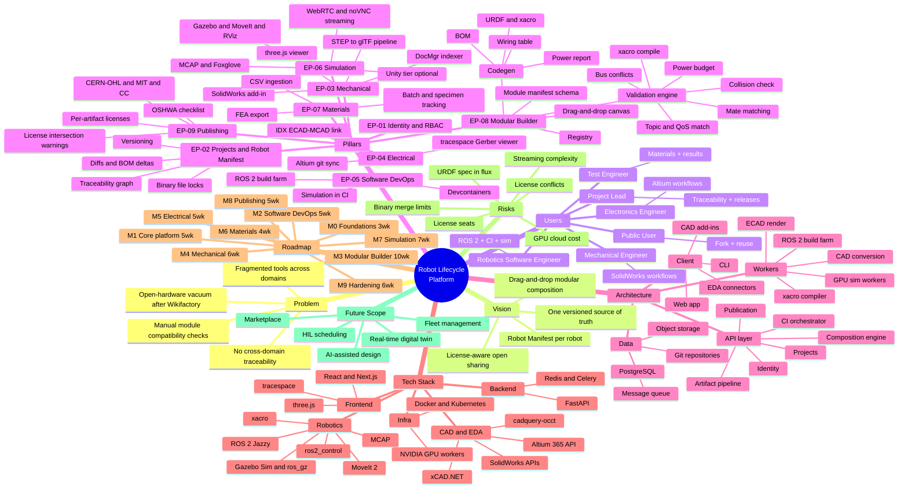

# Project Mind Map — Centralized Robot Lifecycle Platform

## Renderable version (Mermaid `mindmap` — renders in VS Code / GitHub / Obsidian)



## Import-ready outline (XMind / MindMeister / FreeMind)

```text
Centralized Robot Lifecycle Platform
├── Problem
│   ├── Fragmented tools across domains
│   ├── No cross-domain traceability
│   ├── Manual module compatibility checks
│   └── Open-hardware vacuum after Wikifactory
├── Vision
│   ├── One versioned source of truth
│   ├── Robot Manifest per robot
│   ├── Drag-and-drop modular composition
│   └── License-aware open sharing
├── Users
│   ├── Mechanical Engineer (SolidWorks)
│   ├── Electronics Engineer (Altium)
│   ├── Robotics Software Engineer (ROS 2, CI, sim)
│   ├── Test Engineer (materials, results)
│   ├── Project Lead (traceability, releases)
│   └── Public User (fork, reuse)
├── Pillars (Epics)
│   ├── EP-01 Identity & RBAC
│   ├── EP-02 Projects & Robot Manifest
│   │   ├── Versioning
│   │   ├── Binary file locks
│   │   ├── Diffs & BOM deltas
│   │   └── Traceability graph
│   ├── EP-03 Mechanical
│   │   ├── SolidWorks add-in
│   │   ├── DocMgr indexer
│   │   ├── STEP→glTF pipeline
│   │   └── three.js viewer
│   ├── EP-04 Electrical
│   │   ├── Altium git sync
│   │   ├── tracespace Gerber viewer
│   │   └── IDX ECAD-MCAD link
│   ├── EP-05 Software DevOps
│   │   ├── ROS 2 build farm
│   │   ├── Simulation in CI
│   │   └── Devcontainers
│   ├── EP-06 Simulation
│   │   ├── Gazebo / MoveIt / RViz
│   │   ├── WebRTC + noVNC streaming
│   │   ├── MCAP + Foxglove
│   │   └── Unity tier (optional)
│   ├── EP-07 Materials
│   │   ├── Batch & specimen tracking
│   │   ├── CSV ingestion (Instron/Zwick)
│   │   └── FEA export (ANSYS/Abaqus)
│   ├── EP-08 Modular Builder (flagship)
│   │   ├── Module manifest schema
│   │   ├── Registry (interface-tag search)
│   │   ├── Drag-and-drop canvas
│   │   ├── Validation engine
│   │   │   ├── Mate matching
│   │   │   ├── Collision check
│   │   │   ├── Power budget
│   │   │   ├── Bus conflicts
│   │   │   ├── Topic/QoS matching
│   │   │   └── xacro compile
│   │   └── Codegen
│   │       ├── URDF/xacro
│   │       ├── BOM
│   │       ├── Wiring table
│   │       └── Power report
│   └── EP-09 Publishing
│       ├── Per-artifact licenses (CERN-OHL, MIT, CC)
│       ├── License-intersection warnings
│       └── OSHWA checklist
├── Architecture
│   ├── Client (web app, CAD add-ins, EDA connectors, CLI)
│   ├── API layer (identity, projects, artifacts, CI, composition, publication)
│   ├── Workers (CAD conversion, ECAD render, xacro, build farm, GPU sim)
│   └── Data (PostgreSQL, object store, git, message queue)
├── Tech Stack
│   ├── Frontend: React/Next.js, three.js, tracespace
│   ├── Backend: FastAPI, Redis/Celery
│   ├── Robotics: ROS 2 Jazzy, Gazebo Sim + ros_gz, MoveIt 2, ros2_control, xacro, MCAP
│   ├── CAD/EDA: SolidWorks APIs, xCAD.NET, Altium 365 API, cadquery-occt
│   └── Infra: Docker/Kubernetes, NVIDIA GPU workers
├── Roadmap
│   ├── M0 Foundations (3 wk)
│   ├── M1 Core platform (5 wk)
│   ├── M2 Software DevOps (5 wk)
│   ├── M3 Modular Builder (10 wk)
│   ├── M4 Mechanical (6 wk)
│   ├── M5 Electrical (5 wk)
│   ├── M6 Materials (4 wk)
│   ├── M7 Simulation (7 wk)
│   ├── M8 Publishing (5 wk)
│   └── M9 Hardening (6 wk)
├── Risks
│   ├── License seats for CAD conversions
│   ├── Binary merge limits → locks
│   ├── GPU cloud cost
│   ├── URDF spec in flux
│   ├── Streaming complexity
│   └── License conflicts in compositions
└── Future Scope
    ├── AI-assisted design
    ├── Real-time digital twin
    ├── HIL scheduling
    ├── Marketplace
    └── Fleet management
```
