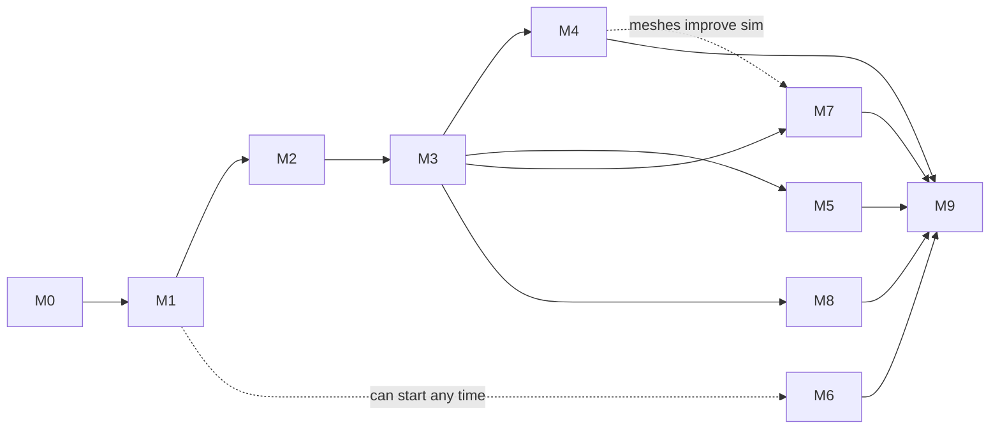

# MERLIN — Execution Phases

> How the platform gets **built**, phase by phase. This is the execution view: it refines the PRD's M0–M9 roadmap into concrete scope, deliverables, and exit criteria, grounded in the current repo state and the backend/frontend designs.
>
> **Canonical phase numbering** (used here, matching `PRD.md` Gantt and `Backend-System-Design.md` §17):
> M0 Foundations · M1 Core · M2 Software DevOps · M3 Modular Builder · M4 Mechanical · M5 Electrical · M6 Materials · M7 Simulation · M8 Publishing · M9 Hardening.

---

## 1. Where we stand (checkpoint)

**M0 deliverables are ~70% done** before a line of platform code exists:

| Done | Remaining for M0 |
|---|---|
| 3 JSON Schemas, validated (robot / module / composition) | Package the validation engine as a real Python library with tests |
| 6 validated example documents | Monorepo scaffolding + docker-compose dev stack |
| All design docs (report, PRD, frontend, backend, README) | CI pipeline that runs schema + engine tests on every push |

Everything below assumes we pick up exactly here.

## 2. Sequencing logic (why this order)

1. **Core before everything** — every later phase stores data in the robot/manifest/git model. No shortcuts here.
2. **Software DevOps early** — ROS builds/tests give the team daily dogfood value immediately and produce the activity/build data every dashboard needs.
3. **Builder at M3, before CAD/EDA integration** — the modular builder is the product's differentiating bet, and its engine needs only *manifests* (already designed) — not the expensive SolidWorks/Altium/GPU planes. Proving composition early de-risks the whole thesis with zero specialized hardware.
4. **Windows/GPU planes as late as their value demands** — SolidWorks/Altium workstations (M4/M5) and GPU sim (M7) are the two heaviest ops burdens; they arrive only once the platform already proves value and has slots waiting for their outputs (viewport, BOM, env strip).
5. **Materials at M6** — cheap, independent, and a "breather" phase between heavy integrations; can be pulled forward freely after M1.
6. **Publishing at M8** — needs real robots/modules worth publishing; also where license enforcement must be airtight.
7. **Hardening last** — HA, load tests, and security reviews only make sense against a complete system.

---

## 3. Phase definitions

### M0 — Foundations · ~3 wk (finish remaining 30%)
**Goal:** everything needed to start product code safely.
- **Scope:** package `merlin-engine` (schema validation + 7 composition checks + referential integrity, from the existing test scripts); monorepo layout (`apps/api`, `apps/web`, `packages/engine`, `compose/`); docker-compose dev stack (Postgres, Redis, MinIO, Gitea); CI running engine + schema tests.
- **Exit criteria:** `docker compose up` → healthy empty stack; `pytest` green in CI; schemas versioned at `1.0.0`.

### M1 — Core Platform · ~5 wk
**Goal:** the centralized state exists and is visible.
- **Backend:** identity (OIDC dev provider), orgs/projects/robots CRUD, Gitea git plane, manifest commit endpoint with schema validation at the API boundary, robot versions (git tag → immutable snapshot row), outbox → WS gateway, activity timeline.
- **Frontend:** app shell (two-scope sidebar, topbar, ⌘K v1 searching robots), robot header + 5-stage pipeline stepper, Overview page read-path (Robot State card, Activity timeline, Key Components).
- **Exit criteria:** create robot → commit manifest → version + activity appear live in UI; an invalid manifest is rejected with precise schema-error paths.

### M2 — Software DevOps · ~5 wk
**Goal:** the platform builds and tests robot software.
- **Backend:** colcon build worker (ROS 2 container), build-graph projection, commit projection from Gitea, test-run ingestion API, search v1 (Postgres FTS), `merlin` CLI v1.
- **Frontend:** Timeline/Build Graph/Test donut panels, commits list, software page.
- **Exit criteria:** push a ROS 2 package → container builds → build graph, test results, and commits render in the UI.

### M3 — Modular Builder · ~10 wk · *the flagship*
**Goal:** drag-and-drop composition with live, real validation.
- **Backend:** module registry (immutable publish, yank, GIN-backed interface search), full composition engine (all 7 checks incl. xacro-compile sidecar + license intersection), `POST /compositions/validate` returning the schema's computed sections verbatim; seed the registry with the repo's 5 example modules.
- **Frontend:** Module Builder screen per `Frontend-Design.md` — library grid, drag-drop with mate-proposal highlighting, live compatibility graph + verdict line, module inspector, outputs view (xacro/BOM/wiring/power).
- **Exit criteria:** assemble the mini-leg (then a full arm) from seed modules in the browser → all checks execute → the CAN-FD warning surfaces exactly as in the example → export xacro + BOM + wiring.

### M4 — Mechanical Integration · ~6 wk
**Goal:** real CAD flows in and becomes viewable/indexed.
- **Backend:** `forge-conv` Windows workstation agent (.NET, pull-based), SolidWorks Document Manager indexing, STEP export, STEP→glTF pipeline (cadquery-occt), artifact + derivative storage (content-addressed).
- **Frontend:** 3D viewport with real glTF, version slider, BOM/mass-delta panel, mechanical page.
- **Exit criteria:** upload `.sldasm` → derivatives generated → browser 3D view → mass properties indexed and linked in the manifest.
- **Gate:** needs a SolidWorks seat. If unavailable, slip M4 — the platform works without it.

### M5 — Electrical Integration · ~5 wk
**Goal:** Altium projects versioned, viewable, linked.
- **Backend:** Altium git sync, COM-automation outputs worker (Gerber/BOM/netlist) or A365 REST where available, tracespace self-host.
- **Frontend:** PCB viewer, BOM-to-board highlight, ECAD↔MCAD link panel, electronics page.
- **Exit criteria:** sync an Altium project → Gerber viewer + BOM in browser → BOM rows linked to manifest electrical artifacts.

### M6 — Materials · ~4 wk
**Goal:** the traceability story closes through physical test data.
- **Backend:** CSV ingestion (Instron/Zwick exports), material→batch→specimen→test→result chain, stats-on-query, result↔artifact-version links, FEA export (ANSYS XML).
- **Frontend:** materials drill-down, stress-strain curves, statistics panel.
- **Exit criteria:** upload a tensile CSV → statistics computed → result linked to the leg part revision → visible in the traceability graph.

### M7 — Simulation · ~7 wk
**Goal:** browser-launchable, recordable sim sessions.
- **Backend:** sim orchestrator + GPU node pool, GZ Sim container (ros_gz, ros2_control, foxglove-bridge), session lifecycle API + quotas, MCAP recording to S3.
- **Frontend:** sim launcher, noVNC + Foxglove embeds, environments status strip, recordings browser.
- **Exit criteria:** launch a session from the robot page → interact with Gazebo in the browser → MCAP saved and replayable in Foxglove.
- **Gate:** GPU access (cloud T4-class is enough to start).

### M8 — Open-Source Publishing · ~5 wk
**Goal:** the public face of MERLIN.
- **Backend:** publication flow (license checks blocking, per-domain intersection report, OSHWA submission, SBOM generation), public registry read-paths, fork/download bundles.
- **Frontend:** publish wizard, public robot/module pages, open-source space, marketplace skeleton.
- **Exit criteria:** publish the demo robot publicly → license report rendered → complete bundle downloadable by an anonymous visitor.

### M9 — Hardening · ~6 wk
**Goal:** production-grade.
- HA Postgres + tested restore drill · load tests against API/validation/search SLOs · security pass (rate limits, upload scanning, secrets audit) · observability dashboards · admin/user docs · multi-workstation fleet support.
- **Exit criteria:** load targets met, runbook written, security checklist signed off.

---

## 4. Timeline

Durations assume **~2 FTE**. Solo effort → multiply by ~1.5–2×.

| Phase | Duration | Cumulative |
|---|---|---|
| M0 (remaining) | 1–2 wk | 2 wk |
| M1 Core | 5 wk | 7 wk |
| M2 Software | 5 wk | 12 wk |
| M3 Builder | 10 wk | 22 wk |
| M4 Mechanical | 6 wk | 28 wk |
| M5 Electrical | 5 wk | 33 wk |
| M6 Materials | 4 wk | 37 wk |
| M7 Simulation | 7 wk | 44 wk |
| M8 Publishing | 5 wk | 49 wk |
| M9 Hardening | 6 wk | **~55 wk (~13 mo)** |

Parallelization options: M4 and M5 can run concurrently with separate owners; M6 can slot anywhere after M1; M7 can start once M3 lands (meshes from M4 improve it but aren't required).

## 5. Path B — Fast-track demo (~4 months)

For a research demo / proof-of-concept that validates the thesis with **zero specialized hardware**:

**M0 (done) → M1 Core → M3 Builder → thin M8 publish page**

Uses seed registry modules and placeholder meshes; skips the Windows and GPU planes entirely. Delivers: centralized robot state, drag-drop validated composition, and a public page — the three claims that make MERLIN distinct — in ~18 weeks solo-adjusted, after which M2/M4–M7 deepen the platform around a proven core.

## 6. Immediate next actions (M0→M1 kickoff)

1. Scaffold the monorepo + compose stack; get `docker compose up` green.
2. Package the validation engine as `merlin-engine` with the existing schema/example tests as its suite.
3. CI workflow running the engine tests + schema self-checks.
4. M1 vertical slice: robot CRUD → manifest commit → schema validation → version row → activity event → visible in the shell.

## 7. Assumptions & knobs

- Team of 1–3 developers; durations at ~2 FTE.
- SolidWorks seat by M4, Altium by M5, GPU access by M7 — each missing one slips only its own phase (the phases are gated, not blocking).
- Product direction (open-source-core SaaS) assumed; the internal-tool variant drops M8 to a minimal sharing phase.
- The three schemas are **frozen at 1.0.0** during M1–M3; breaking changes go through an RFC step and a `1.1.0` bump.
