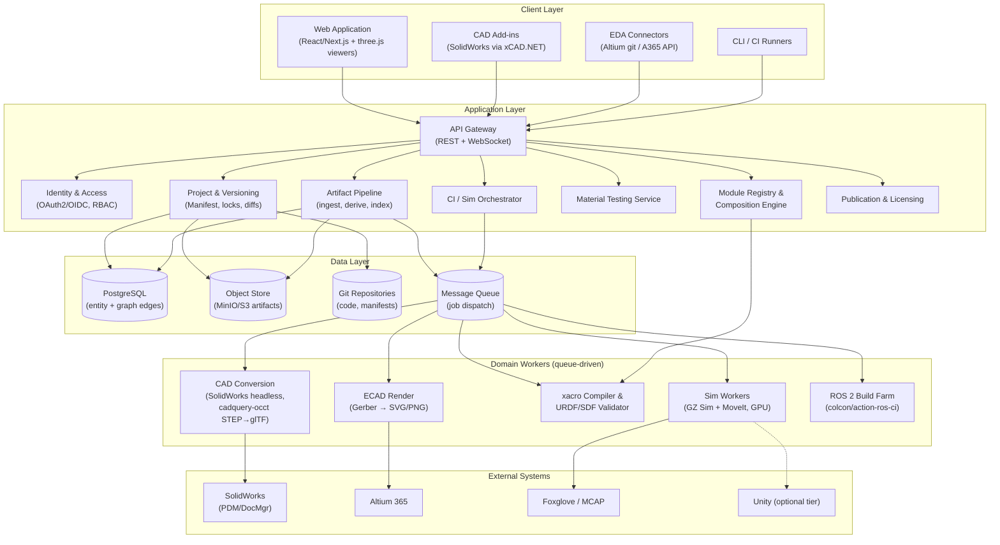
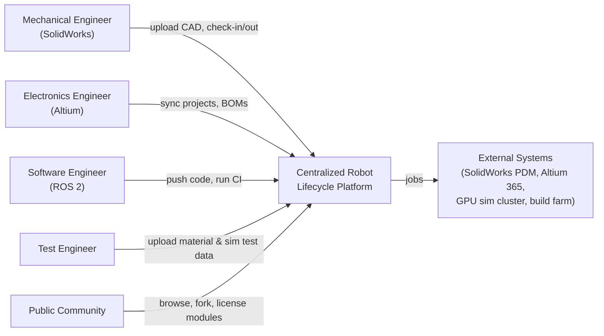
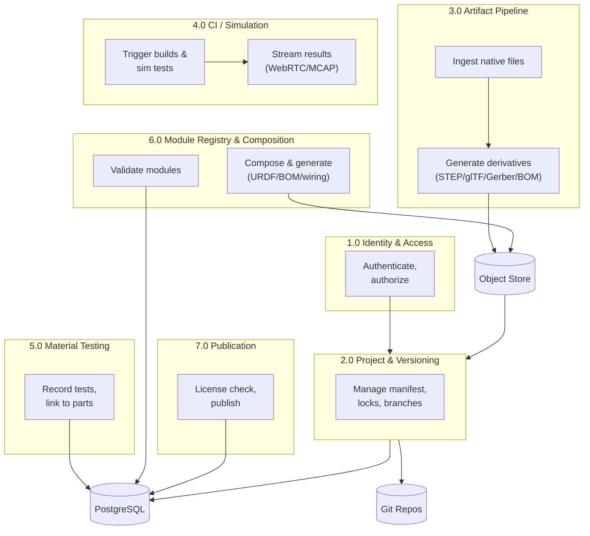
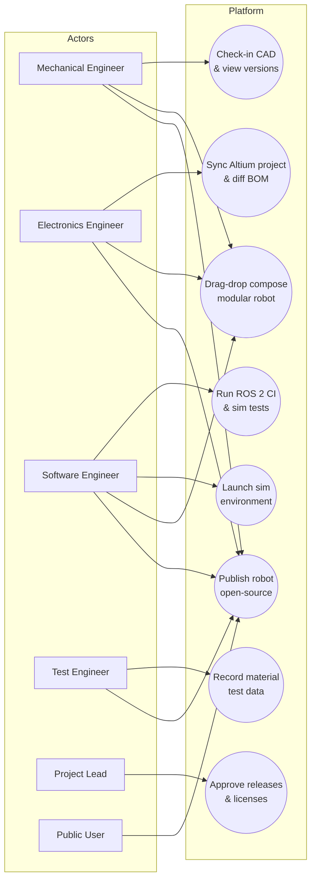
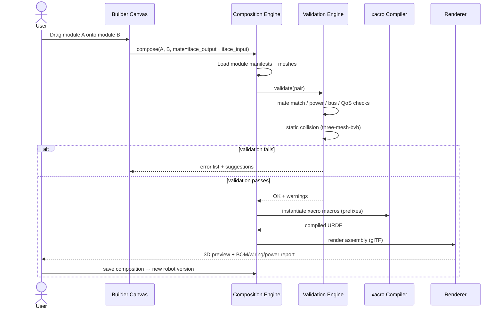

# Streamlining Robot Design, Building, and Testing Through a Centralized Robot State Repository with Modular Composition and Open-Source Sharing

**A Project Report**

---

## 2. Introduction

Modern robot development is inherently multidisciplinary. A single robot integrates mechanical design (CAD in SolidWorks), electrical and electronic design (EDA in Altium), firmware and control software (ROS 2, embedded C/C++), material selection backed by physical testing, and extensive validation in simulation environments such as Gazebo, RViz, MoveIt, and Unity. Today, each of these domains lives in a different tool, a different storage system, and often a different team's workflow: CAD files sit in PDM vaults or shared drives, schematics in Altium workspaces, code in Git repositories, simulation models in local Gazebo installations, and material test reports in spreadsheets. There is **no single system that links all of these artifacts into one versioned, traceable state of the robot**.

This fragmentation produces concrete problems:

1. **Broken traceability.** When a mechanical part changes, there is no automatic way to see which PCB, which software node, or which test result is affected. Impact analysis is manual and error-prone.
2. **Duplicated and drifting data.** The same robot exists as a SolidWorks assembly, an Altium project, a URDF model, and a Gazebo world — maintained independently, quickly diverging from one another.
3. **Painful module reuse.** Teams that build robots from reusable modules (actuators, joints, power units, sensor pods) must manually verify mechanical compatibility (bolt patterns, flanges), electrical compatibility (bus protocols, power budgets), and software compatibility (ROS 2 interfaces) — with no tooling to automate any of it.
4. **Simulation is siloed.** Simulation environments (Gazebo, MoveIt, RViz, Unity) are typically set up per developer on local machines; there is no centralized, shareable, browser-accessible simulation workspace tied to the current design state.
5. **Material test data is disconnected.** Tensile, impact, and fatigue results exist in spreadsheets and PDFs, unlinked from the CAD parts and FEA material models they should feed.
6. **Open-source robotics publishing is fragmented.** Wikifactory (the leading open-hardware community platform) shut down; robot projects are scattered across GitHub (code), Printables/Thingiverse (STLs), Hackaday.io (logs), and personal wikis. No platform publishes a *complete* robot — mechanics + electronics + software — with per-artifact licensing and versioning.

### Objectives

The proposed system — a **Centralized Robot Lifecycle Platform** — aims to:

- **O1.** Provide a single source of truth ("centralized state of the robot") that links mechanical, electrical, software, simulation, and test artifacts in one versioned repository.
- **O2.** Integrate with SolidWorks and Altium through APIs and file-sync connectors to make CAD/EDA designs versionable, viewable in-browser, and diffable.
- **O3.** Provide a managed DevOps environment for robot software: ROS 2 build/test pipelines, containerized development, and simulation-in-CI.
- **O4.** Provide centralized, browser-accessible simulation environments (Gazebo, RViz, MoveIt, and an optional Unity tier) driven by the same robot description files used in production.
- **O5.** Manage material testing data with full traceability from material batch → specimen → test → results → CAD part revision → FEA material card.
- **O6.** Deliver a **drag-and-drop modular robot builder**: a registry of prebuilt modules (each bundling mechanics, electronics, and software) with automated compatibility validation and generation of the assembled robot description, BOM, and wiring.
- **O7.** Provide a public space to open-source complete robots and modules with per-artifact licensing (CERN-OHL, MIT/Apache, CC) and license-conflict detection on composition.

### Scope

The scope covers the design data lifecycle — from design authoring integration through simulation, testing, modular composition, and publication. It explicitly excludes real-time robot fleet management (telemetry from deployed robots), which is addressed by existing platforms (Viam, Formant, Foxglove) and may be a future extension.

---

## 3. Literature Survey

### 3.1 Product Lifecycle Management (PLM) and CAD Data Management

Commercial PLM suites — Dassault Systèmes 3DEXPERIENCE [1] and Siemens Teamcenter [2] — demonstrate that cross-domain traceability between mechanical, electrical, and software artifacts is valuable and sellable. However, they are enterprise-priced, file-centric, closed systems with no open-source sharing model and no ROS 2 or robotics-simulation integration.

Onshape (PTC) [3] proved that cloud CAD with a REST API, feature-level scripting (FeatureScript), and git-style branch/merge versioning is technically feasible and commercially successful — but it is CAD-only, and its model requires authors to adopt Onshape as their CAD tool.

### 3.2 "Git for Hardware" and Cloud EDA

A wave of startups attempted to become "GitHub for hardware": InventHub, Cadlab.io, and Flux.ai. Most have pivoted or gone quiet; AllSpice.io [6] survives but has refocused on ECAD review automation rather than the general hardware-repository vision. This history is instructive: versioning binary CAD files is a hard problem because `.sldprt`/`.sldasm` and `.SchDoc`/`.PcbDoc` are opaque binary formats that cannot be semantically diffed or merged. Practical systems use **lock-based checkout** for binaries and git for text artifacts.

Altium 365 [4] is the most successful cloud-EDA offering: it provides git-based version control for Altium projects, a REST + Python API, a web viewer for schematics/PCBs requiring no Designer license, and ECAD-MCAD co-design via Altium CoDesigner and the neutral IDX format [5]. Altium Designer also has native git integration built on libgit2 [34].

On the mechanical side, SOLIDWORKS offers the free **Document Manager API** [32] (reads references, configurations, custom properties, and BOMs from `.sldprt`/`.sldasm`/`.slddrw` without a running SolidWorks session), the PDM Professional API including a 2025 web-service variant [31], and add-in automation via COM/.NET (facilitated by the open-source xCAD.NET framework [33]). Geometry export (STEP/Parasolid) requires a licensed SolidWorks seat, which motivates a dedicated headless "conversion workstation" queue pattern.

### 3.3 Open-Source Hardware Sharing and Licensing

The social open-hardware space suffered a major vacuum when **Wikifactory** shut down its community platform (~2022–2023) and pivoted to a commercial cloud PDM for SolidWorks [7]. No successor fills the niche of structured, versioned, license-aware publication of complete hardware projects. Analysis of license usage in 2025 [12] shows MIT dominating raw counts while OSHWA certification trends favor CERN-OHL-S-2.0 [13]; the OSHWA licensing guidelines were updated accordingly [11]. Leading open robot projects (Stanford Quadruped [15], Open Dynamic Robot Initiative [14]) use software licenses (MIT/BSD) for everything, which is legally awkward for hardware — evidence that a platform providing proper per-artifact licensing (CERN-OHL-P/S for hardware, MIT/Apache for code, CC-BY-SA for docs) addresses a real need.

### 3.4 Modular Robotics and Composition

Existing modular systems provide strong conceptual precedents:

- **HEBI Robotics** [16]: self-contained smart actuator modules (motor + gearbox + encoder + drive electronics) with standardized mechanical mounting interfaces, daisy-chained communication, and a robot description format (HRDF) decoupled from hardware. Their SCOUT app assembles robots graphically from declared module interfaces.
- **Open Dynamic Robot Initiative (ODRI)** [14]: open-source torque-controlled actuator modules in multiple sizes sharing one flange pattern family, open driver boards, CAN-FD bus, with CAD + firmware + URDF released together — the model of a complete open "module bundle."
- **Viam** [8]: the strongest software-side contract model. Hardware capabilities map to standard component APIs; a *module* is an executable exposing gRPC services registered under a `namespace:family:name` triplet, published to a public registry and assembled via configuration files. Viam proves demand for modular assembly but carries no design-lifecycle data (CAD, ECAD, test results).
- **Interactive Robogami (MIT, Schulz et al.)** [19]: the closest prior art for drag-and-drop hardware design — a database of parameterized parts with typed connectors; the UI snaps compatible connectors, validates constraints, and auto-generates geometry and control code.
- Industrial examples (RobCo Studio [17], Beckhoff ATRO [18]) confirm commercial interest in modular, configurator-driven robot platforms.

A critical finding: **no digital standard exists for describing a module's mechanical/electrical/software interfaces** — this is a gap the proposed system can define and own.

### 3.5 Robot Software, Simulation, and Testing

The modern open-source stack centers on ROS 2 (Jazzy) with Gazebo Sim (the Ignition successor) connected via `ros_gz` bridges [22], MoveIt 2 for manipulation, and `ros2_control` for controller/hardware abstraction [25]. CI for ROS 2 is standardized by `ros-tooling/action-ros-ci` [23] (vcs import → rosdep → colcon build/test) and integration testing via `launch_testing` [24]. Recording has standardized on MCAP [27].

Browser access to simulation is achievable via WebRTC/noVNC streaming of the native GUI plus Foxglove [9] for topic visualization — the approach proven at scale by cloud robotics education platforms. gzweb and robotwebtools are unmaintained. NVIDIA Isaac Sim [28] offers photoreal simulation but requires RTX GPUs and NVIDIA-only EULAs; Webots [29] is a low-GPU open alternative. Unity connects to ROS 2 through the ROS-TCP-Connector and URDF Importer [26] but lacks a native physics/control ecosystem, making it suitable as a visualization tier rather than the physics engine.

The URDF format itself is mid-modernization (kinematic-loop support tracked in ros/urdf#13 [30]), so the platform's data model must tolerate tree-structure evolution.

### 3.6 Material Testing Data Management

Material test data today is managed in commercial LIMS (LabWare, QBench [40]) — overkill for non-regulated robotics teams — or spreadsheets. The open-source SENAITE LIMS [39] is analytical-chemistry-shaped. The data standard MatML is dormant; the practical approach is a purpose-built JSON schema using ASTM vocabulary (E8/E8M tensile, E23 impact, E466 fatigue) with explicit units, file-based ingestion from test machines (Instron Bluehill, Zwick testXpert both export CSV [41][42]), and export adapters to FEA material formats (ANSYS Engineering Data XML, Abaqus `.inp` cards). Ansys Granta MI [38] is the commercial benchmark for pedigree + approval workflows linking materials to CAD/PLM/FEA. Reference databases (MatWeb, Total Materia [43]) and the OPTIMADE API convention [44] inform the schema design.

### 3.7 Comparative Summary

| System | CAD | ECAD | Software/ROS | Simulation | Material Tests | Modular Builder | Open Publishing |
|---|---|---|---|---|---|---|---|
| 3DEXPERIENCE / Teamcenter | Yes | Yes | Limited | No | Via Granta | No | No |
| Onshape | Yes | Partner | No | No | No | No | Partial |
| Altium 365 | CoDesigner | Yes | No | No | No | No | No |
| Viam | No | No | Yes | No | No | Software modules | Module registry |
| Foxglove | No | No | Data only | Viz only | No | No | No |
| Wikifactory (defunct) | PDM now | No | No | No | No | No | Was yes |
| **Proposed System** | **Yes** | **Yes** | **Yes** | **Yes** | **Yes** | **Yes (mech+elec+sw)** | **Yes, license-aware** |

---

## 4. Proposed Solution

### 4.1 Core Concept: The Robot Manifest

The platform's central abstraction is the **Robot Manifest** — a versioned YAML document that constitutes the single source of truth for a robot. It references artifacts rather than containing them:

```yaml
robot:
  id: "quadruped_x1"
  name: "Quadruped X1"
  version: "2.3.0"
  license: { hardware: "CERN-OHL-P-2.0", software: "MIT", docs: "CC-BY-SA-4.0" }
  systems:
    mechanical:
      - { part: "leg_assembly", cad: "cad/legs.sldasm", step: "derivatives/legs.step",
          gltf: "derivatives/legs.gltf", bom: "bom/mech.json" }
    electrical:
      - { board: "motor_driver", project: "pcb/motor_driver.PrjPcb",
          gerbers: "derivatives/motor_driver.gbr", bom: "bom/ecad.json" }
    software:
      - { repo: "https://git.example.com/quadruped_control", distro: "jazzy",
          ci: { pipeline: "build+simtest", last_status: "green" } }
    simulation:
      - { urdf: "urdf/robot.urdf.xacro", srdf: "moveit/robot.srdf",
          worlds: ["worlds/indoor.sdf"], moveit_config: "moveit/", unity_asset: "unity/Quadruped" }
    testing:
      - { material_tests: ["tests/tensile_legs_2026-03.csv"],
          sim_results: ["results/sim_2026-06-12.mcap"], verdict: "PASS" }
  modules:
    - { id: "odri_actuator_60", version: "1.2.0" }
    - { id: "battery_pack_48v", version: "0.4.1" }
```

Design principles (from the research findings):

1. **Native + derivatives.** Native authoring files (`.sldasm`, `.SchDoc`) are the canonical data; generated derivatives (STEP, glTF, Gerbers, rendered images, BOM JSON) are committed alongside for web viewing, diffing, and indexing. Derivatives are never editable.
2. **Git for text, locks for binaries.** Manifests, code, and code-first CAD (CadQuery/build123d) use git branches and merges; binary CAD/EDA files use lock-based checkout, since semantic merge of binaries remains unsolved industry-wide.
3. **Everything is a graph.** Artifacts, parts, tests, batches, modules, and publications are nodes with typed, versioned edges, enabling bidirectional traceability queries (e.g., "which ROS nodes depend on this joint's controller?").

### 4.2 Feature Set

- **F1. Project & version management** — organizations, projects, git-backed storage, version history, lock-based checkout for binaries, web-based diff (BOM/mass-property deltas + side-by-side renders).
- **F2. CAD integration (SolidWorks)** — desktop add-in (xCAD.NET) for upload/check-in; Document Manager API indexer for references/BOMs/mass properties without SolidWorks running; headless conversion workstation for STEP/Parasolid export; STEP→glTF pipeline (cadquery-occt/FreeCAD) + three.js viewer.
- **F3. EDA integration (Altium)** — native git sync for Altium projects; Altium 365 REST API integration; Gerber rendering via tracespace; BOM extraction; ECAD-MCAD linkage via IDX artifacts.
- **F4. Software DevOps for robots** — hosted git, containerized dev environments (ROS 2 Jazzy images), CI pipelines (action-ros-ci pattern), sim-in-CI with launch_testing, build/test status surfaced on the robot page.
- **F5. Simulation environments** — managed Gazebo Sim + MoveIt 2 + RViz2 workspaces per robot, launched from the same URDF/xacro/SRDF; browser access via WebRTC/noVNC + Foxglove; MCAP recording and replay; optional Unity visualization tier (ROS-TCP-Connector).
- **F6. Material testing** — materials, batches/lots (COA), specimens, tests (ASTM E8/E23/E466), typed results with explicit units, statistics on query, links to CAD part revisions and FEA export (ANSYS/Abaqus formats).
- **F7. Modular robot builder** — module registry with validated manifests; drag-and-drop canvas; automated compatibility checks; generation of composed URDF (xacro), BOM, wiring table, and power report.
- **F8. Open-source publishing** — public robot/module pages, per-artifact licensing, OSHWA-aligned release workflow (editable sources mandatory), license-intersection warnings when modules are combined, discovery/search.

### 4.3 The Module Manifest (foundation of F7)

Each module is a versioned package declaring typed interfaces across three domains:

```yaml
module:
  id: "odri_actuator_60"
  name: "ODRI 60 mm Actuator"
  version: "1.2.0"
  category: "actuator"          # actuator | link | sensor | power | controller | endeffector
  license: "BSD-3-Clause"
mechanical:
  mass_kg: 0.48
  com: [0, 0, 0.02]
  inertia: { ixx: .., iyy: .., izz: .., ixy: .., ixz: .., iyz: .. }
  bounding_box_m: { x: 0.06, y: 0.06, z: 0.11 }
  joints:
    - { name: "output", type: "revolute", axis: [0,0,1],
        limits: [-3.14, 3.14], effort_Nm: 6.0, velocity_rad_s: 20.0 }
  frames:
    - { name: "input",  xyz: [0,0,0],    rpy: [0,0,0] }
    - { name: "output", xyz: [0,0,0.06], rpy: [0,0,0] }
  interfaces:
    - { id: "iface_output", kind: "flange", side: "female",
        bolt_pattern: "6xM3_on_25mm_PCD", pilot_diameter_mm: 8.0,
        plane: "output", normal: [0,0,1],
        load_axial_N: 200, load_moment_Nm: 8,
        compatible_with: ["pattern:6xM3_on_25mm_PCD"] }
electrical:
  buses:
    - { id: "bus_main", protocol: "CAN-FD", baud: 5000000, topology: "daisy",
        connector: "JST-GH-4", pinout: { 1: CAN_H, 2: CAN_L, 3: GND, 4: 24V_aux } }
  power:
    - { voltage_range: [10, 48], nominal: 24, standby_A: 0.15,
        peak_A: 4.0, peak_duty_pct: 10, connector: "XT30", provided: false }
software:
  ros2:
    - { pkg: "odri_driver", node: "actuator_node", lifecycle: true,
        topics: [ { name: "~/state", type: "sensor_msgs/JointState", qos: "sensor" } ],
        params: ["gear_ratio", "torque_constant"] }
  urdf:
    fragment: "urdf/actuator.macro.xacro"
    macro: "odri_actuator_macro"
    params: ["prefix", "parent_link", "child_link", "origin_xyz", "origin_rpy"]
```

### 4.4 Composition and Validation Rules (F7 engine)

When modules are dragged together, the composition engine performs, in priority order:

1. **Mechanical mate matching** — interface kind equality (flange↔flange), bolt pattern and pilot diameter equality, male/female complementarity.
2. **Load computation** — sum of downstream module masses vs. each joint's axial/moment ratings.
3. **Static collision check** — mesh intersection (three-mesh-bvh in-browser / trimesh server-side) between module pairs and ground, sampled across joint limits.
4. **Power budget** — voltage range intersection; standby + derated peak current summation; provider/consumer balance; connector mismatch flags (XT30 vs XT60).
5. **Bus validation** — protocol + baud equality, topology feasibility (daisy vs star), duplicate node-ID detection.
6. **Software interface matching** — topic/service type + QoS compatibility between declared publishers and subscribers; controller plugin presence for every actuated joint.
7. **xacro build test** — the composed description is actually compiled server-side with `xacro`, catching parameter and macro errors cheaply.

Outputs: composed URDF/xacro package, consolidated BOM (with fastener rules per interface type), wiring table (interface pair → cable specification), power report, license-intersection report, and Gazebo/Unity-ready assets.

---

## 5. System Architecture

A layered, service-oriented architecture with a domain-worker pool for heavy conversions and an orchestration layer for CI and simulation.



**Key architectural decisions:**

- **Event-driven derivative generation.** Every artifact upload emits an event; workers generate derivatives (STEP/glTF/Gerber renders/BOM JSON) asynchronously and commit them back into the object store. The manifest always knows which derivatives are stale.
- **Abstraction over vendor APIs.** SolidWorks access is wrapped behind a `CadVault` interface (implementations: PDM API, plain add-in upload, 3DEXPERIENCE), so the store backend is swappable and no single vendor lock-in exists.
- **GPU economics.** Simulation sessions are tiered: CPU-only headless runs for logic/CI tests; GPU (T4/L4) sessions on demand for sensor-rendering and Unity tier, with suspend/checkpoint and software-rendering fallback.
- **Single robot description source.** URDF/xacro/SRDF/SDF are first-class artifacts in the manifest; Gazebo, MoveIt, RViz, Foxglove, and Unity all consume the same files, eliminating description drift.

---

## 6. Technology / Tools Required

| Layer | Technology | Purpose |
|---|---|---|
| Frontend | React / Next.js, TypeScript | Web application |
| 3D & viewers | three.js, three-mesh-bvh, urdf-loader | STEP/glTF viewing, collision, URDF viz |
| PCB viewer | tracespace.io, InteractiveHtmlBom | Gerber rendering, BOM-to-board highlight |
| Backend | FastAPI (Python), Redis, Celery/RQ | API, caching, job queue |
| Database | PostgreSQL (+ JSONB), pgvector (search) | Entities, graph edges, version history |
| Storage | MinIO/S3, Gitea/GitLab (git) | Artifact objects, code/manifests |
| Auth | Keycloak (OIDC), RBAC | Identity, organizations |
| Deployment | Docker, Kubernetes/Compose, NVIDIA Container Toolkit | Services, GPU sim workers |
| Robotics stack | ROS 2 Jazzy, colcon, vcs, rosdep, xacro, URDF/SDF/SRDF, MCAP | Build, descriptions, recording |
| Simulation | Gazebo Sim (Harmonic/Ionic), ros_gz, MoveIt 2, ros2_control, RViz2, launch_testing, Webots (alt) | Managed sim environments |
| Streaming | WebRTC / noVNC, Foxglove bridge | Browser access to sim + data |
| CI | GitHub/Gitea Actions, ros-tooling/action-ros-ci, colcon build farm | ROS 2 pipelines, sim-in-CI |
| CAD integration | SOLIDWORKS Document Manager API, PDM Pro API, xCAD.NET, SolidWorks COM API | Metadata, versioning, STEP export |
| CAD pipeline | cadquery-occt / FreeCAD headless, trimesh | STEP→glTF, inertia computation |
| EDA integration | Altium git (libgit2), Altium 365 REST/Python API, IDX | Versioning, BOM, ECAD-MCAD link |
| CAD→URDF | OnShape-to-Robot, Phobos (Blender), SolidWorks URDF Exporter | Module-authoring ingestion |
| Unity (optional) | Unity Robotics Hub, ROS-TCP-Connector, URDF Importer | Photoreal visualization tier |
| Material testing | CSV ingestion (Instron Bluehill / Zwick testXpert), JSON schema (ASTM E8/E23/E466 vocabulary), FEA export (ANSYS XML, Abaqus .inp) | Test data pillar |

---

## 7. Flowchart / DFD / UML Diagrams

### Fig. 1 — Context Diagram (DFD Level 0)



### Fig. 2 — Data Flow Diagram (Level 1)



### Fig. 3 — Use Case Diagram



### Fig. 4 — Flowchart: Artifact Ingestion & Derivative Pipeline

```mermaid
flowchart TD
    S[Start: artifact uploaded] --> T{Type detect}
    T -->|CAD native| A1[Store native in object store]
    T -->|EDA project| E1[Store native / git repo]
    T -->|code/manifest| G1[Commit to git]
    A1 --> A2[Queue: DocMgr metadata extract]
    E1 --> E2[Queue: Gerber render + BOM]
    G1 --> G3[Trigger CI if software]
    A2 --> A3{Geometry export<br/>needed?}
    A3 -->|yes| A4[SolidWorks headless worker:<br/>STEP/Parasolid export]
    A3 -->|no| A5[Use existing STEP]
    A4 --> A6[cadquery-occt: STEP → glTF]
    A5 --> A6
    E2 --> E7[Store Gerber SVG + BOM JSON]
    A6 --> A8[Compute mass/inertia (trimesh)]
    A8 --> A9[Index metadata in PostgreSQL]
    E7 --> A9
    A9 --> A10[Update robot manifest,<br/>mark derivatives fresh]
    A10 --> Z[Notify clients via WebSocket]
```

### Fig. 5 — Sequence Diagram: Modular Composition



---

## 8. Database Design

### Fig. 6 — Entity Relationship Diagram

```mermaid
erDiagram
    ORGANIZATION ||--o{ PROJECT : owns
    ORGANIZATION ||--o{ MEMBERSHIP : has
    USER ||--o{ MEMBERSHIP : joins
    PROJECT ||--o{ ROBOT : contains
    ROBOT ||--o{ ROBOT_VERSION : versioned_as
    ROBOT_VERSION ||--o{ ARTIFACT : references
    ROBOT_VERSION ||--o{ COMPOSITION : composed_of
    ARTIFACT ||--o{ DERIVATIVE : derives
    ARTIFACT ||--o{ ARTIFACT_VERSION : has_versions
    MODULE ||--o{ MODULE_VERSION : versioned_as
    MODULE_VERSION ||--o{ INTERFACE : declares
    MODULE_VERSION ||--o{ COMPOSITION : used_in
    INTERFACE }o--|| INTERFACE_KIND : typed_as
    MODULE ||--o{ LICENSE : licensed
    ROBOT ||--o{ LICENSE : licensed
    MATERIAL ||--o{ BATCH : produced_in
    BATCH ||--o{ SPECIMEN : sampled_as
    SPECIMEN ||--o{ TEST : tested_by
    TEST ||--o{ TEST_RESULT : yields
    TEST_RESULT }o--o{ ARTIFACT_VERSION : links_to_part
    ROBOT_VERSION ||--o{ BUILD : has
    BUILD ||--o{ TEST_RUN : includes
    ROBOT_VERSION ||--o{ SIM_SESSION : runs_in
    ROBOT_VERSION ||--o{ PUBLICATION : published_as
    PUBLICATION ||--o{ LICENSE : carries

    USER { uuid id PK; string email; string name; string role }
    ORGANIZATION { uuid id PK; string name; string plan }
    MEMBERSHIP { uuid id PK; uuid user_id FK; uuid org_id FK; string role }
    PROJECT { uuid id PK; uuid org_id FK; string name; string visibility }
    ROBOT { uuid id PK; uuid project_id FK; string name; string category }
    ROBOT_VERSION { uuid id PK; uuid robot_id FK; string semver; string manifest_yaml; datetime created_at }
    ARTIFACT { uuid id PK; string name; string domain; string format }
    ARTIFACT_VERSION { uuid id PK; uuid artifact_id FK; string object_key; string sha256; boolean locked; uuid locked_by }
    DERIVATIVE { uuid id PK; uuid artifact_version_id FK; string kind; string object_key; string status }
    MODULE { uuid id PK; string name; string category; uuid owner_id FK }
    MODULE_VERSION { uuid id PK; uuid module_id FK; string semver; json manifest }
    INTERFACE { uuid id PK; uuid module_version_id FK; string domain; string kind; json spec; string tags }
    INTERFACE_KIND { string id PK; string description }
    COMPOSITION { uuid id PK; uuid robot_version_id FK; uuid module_version_id FK; json mate_config }
    LICENSE { string id PK; string name; string domain; boolean copyleft }
    MATERIAL { uuid id PK; string name; string family; string designation; string status }
    BATCH { uuid id PK; uuid material_id FK; string lot_number; json coa; date received }
    SPECIMEN { uuid id PK; uuid batch_id FK; string geometry; string orientation }
    TEST { uuid id PK; uuid specimen_id FK; string standard; string machine; json conditions }
    TEST_RESULT { uuid id PK; uuid test_id FK; string property; float value; string unit }
    BUILD { uuid id PK; uuid robot_version_id FK; string pipeline; string status }
    TEST_RUN { uuid id PK; uuid build_id FK; string result; string artifacts_key }
    SIM_SESSION { uuid id PK; uuid robot_version_id FK; string sim_engine; string gpu_profile }
    PUBLICATION { uuid id PK; uuid robot_version_id FK; string status; string oshwa_cert }
```

### Table Design Notes

- **Graph edges as join tables.** Traceability (part ↔ test ↔ FEA card ↔ module) is modeled with explicit join tables (`TEST_RESULT`–`ARTIFACT_VERSION`, `COMPOSITION`), keeping the model relational while enabling recursive CTE queries for impact analysis.
- **`ROBOT_VERSION.manifest_yaml`** stores the full resolved manifest at each release point (immutable snapshot semantics).
- **Locks** live on `ARTIFACT_VERSION` (`locked`, `locked_by`) for binary checkout semantics; text artifacts are unlocked and branchable.
- **`LICENSE`** is a reference table; publications and modules carry license bindings per domain (hardware/software/docs), enabling license-intersection computation.
- **Statistics** (n, mean, std per material property) are computed on query from `TEST_RESULT`, never stored — preventing stale aggregates.

---

## 9. User Interface Design

### 9.1 Screen Inventory

| Screen | Purpose | Key Elements |
|---|---|---|
| Dashboard | Org/project overview | Activity feed, CI status, open locks |
| Robot Workspace | The "centralized state" view | Manifest tree, artifact tabs (Mechanical/Electrical/Software/Simulation/Testing), version history, traceability graph |
| CAD Viewer | Mechanical review | three.js 3D viewport, version slider, BOM/mass delta panel, comment pins |
| PCB Viewer | Electrical review | tracespace Gerber layers, BOM-to-board highlight, ECAD-MCAD link panel |
| Software & CI | Builds/tests | Pipeline list, colcon logs, sim-test results, MCAP replay (Foxglove) |
| Simulation Launcher | Sim environments | Engine selector (Gazebo/MoveIt/RViz/Unity), GPU profile, WebRTC stream panel |
| Material Testing | Test data | Material/batch/specimen drill-down, stress-strain curves, statistics, part links |
| Module Registry | Module discovery | Search/filter by interface tags, manifest view, license badge, versions |
| **Modular Builder** | Drag-drop composition | Module palette, 3D canvas, compatibility inspector, generated BOM/wiring/power panels |
| Publication | Open-source release | License editor (per artifact), OSHWA checklist, README render, fork/download |

### 9.2 Wireframe — Modular Builder (flagship screen)

```
┌──────────────────────────────────────────────────────────────────────────────┐
│  Modular Builder                          [Save] [Validate] [Export ▾]      │
├───────────────┬──────────────────────────────────────────┬───────────────────┤
│ MODULE PALETTE│             3D CANVAS                     │ INSPECTOR          │
│ [search...]   │      ┌─────────────────────┐              │ Mates:             │
│               │      │   ┌────┐            │              │  ✓ flange 6xM3 PCD25│
│ ▸ Actuators   │      │   │Base│─┐          │              │  ✓ pilot 8mm       │
│   odri_60     │      │   └────┘ │ ┌──────┐ │              │ Power: 24V nominal │
│   cubemars_ak │      │           ├─│Arm L1│ │              │  ✓ voltage overlap │
│ ▸ Links       │      │   ┌────┐ │ └──────┘ │              │  ⚠ peak 4.2A > 4A  │
│   tube_300    │      │   │Batt│─┘          │              │ Bus: CAN-FD 5M     │
│ ▸ Sensors     │      │   └────┘            │              │  ✓ node IDs unique │
│   imu_9dof    │      │  drag to snap       │              │ Software:          │
│ ▸ Power       │      └─────────────────────┘              │  ✓ JointState QoS  │
│   batt_48v    │                                           │ Collisions: none   │
├───────────────┴──────────────────────────────────────────┴───────────────────┤
│ GENERATED: robot.xacro ✓ | BOM: 42 lines | Wiring: 3 cables | Power: 96W/48V │
└──────────────────────────────────────────────────────────────────────────────┘
```

---

## 10. Expected Output / Future Scope

### Expected Outputs

1. A working web platform storing complete robot projects (mechanical, electrical, software, simulation, test data) with version history and browser-based CAD/PCB viewing.
2. Bidirectional traceability: any change to a part, board, node, or test is linked to everything it affects.
3. Managed simulation workspaces launchable from the browser, running the same robot descriptions used in CI and on hardware.
4. A module registry and drag-and-drop builder that validates physical, electrical, and software compatibility and generates assembled URDF/xacro, BOM, wiring, and power reports.
5. A public open-source robot space with per-artifact licensing and automated license-conflict reporting.
6. Material test records traceable from batch/lot to CAD part revision and FEA material card.

### Future Scope

- **AI-assisted design** — LLM agents over the artifact graph (propose module substitutions, summarize impact of a change, generate xacro fragments).
- **Real-time digital twin** — connect deployed robots (Viam/Foxglove-style telemetry) back to the design state; compare sim vs. real MCAP recordings for drift analysis.
- **Hardware-in-the-loop scheduling** — manage shared physical test benches, running the same tests as simulation with `ros2_control` real interfaces.
- **Marketplace** — commerce layer for proprietary modules alongside the open registry.
- **URDF 2.x migration** — adopt closed-kinematic-loop support when the URDF spec modernization lands.
- **Compliance workflows** — OSHWA certification, export control, and safety-standard checklists (ISO 10218/13482) as first-class project gates.
- **Fleet management** — extend the runtime side into full fleet operations.

---

## 11. Bibliography / References

1. Dassault Systèmes — 3DEXPERIENCE Platform. https://www.3ds.com/products/3dexperience
2. Siemens — Teamcenter PLM. https://www.plm.automation.siemens.com/global/en/products/teamcenter/
3. PTC Onshape — Cloud CAD, Branch & Merge, API. https://www.onshape.com/en/features/branch-merge-cad
4. Altium 365 API — Developer Center. https://www.altium.com/documentation/altium-developer-center/altium-365/api
5. Altium — ECAD/MCAD CoDesign (CoDesigner, IDX). https://resources.altium.com/en/cad-codesign
6. AllSpice.io — Git-based hardware revision control. https://www.allspice.io/
7. Wikifactory — platform pivot to cloud PDM for SolidWorks. https://wikifactory.com/platform/
8. Viam — Modular Resources & Registry. https://docs.viam.com/registry/
9. Foxglove — Robot data platform. https://foxglove.dev/
10. AWS — Deploying ROS robots with IoT Greengrass v2 + Docker (RoboMaker replacement). https://aws.amazon.com/blogs/robotics/deploy-and-manage-ros-robots-with-aws-iot-greengrass-2-0-and-docker/
11. OSHWA — Hardware licensing guidelines update. https://oshwa.org/announcements/oshwa-updates-hardware-licensing-guidelines/
12. M. Weinberg — The Most Popular Open Source Hardware Licenses (2025). https://michaelweinberg.org/blog/2025/10/05/leading-licenses/
13. CERN — Open Hardware Licence v2. https://ohwr.org/project/cernohl
14. Open Dynamic Robot Initiative. https://open-dynamic-robot-initiative.github.io/
15. Stanford Robotics Club — Stanford Quadruped. https://github.com/stanfordroboticsclub/StanfordQuadruped
16. HEBI Robotics — Hardware & Module documentation (HRDF). https://docs.hebi.us/hardware.html
17. RobCo — RobCo Studio configurator & digital twin. https://www.rob.co/technology/software/robco-studio
18. Beckhoff — ATRO modular industrial robot system. https://www.beckhoff.com/en-en/company/press/atro-modular-industrial-robot-system-with-additional-link-modules-2023-06.html
19. A. Schulz et al. — Interactive Robogami: An End-to-End System for Design of Robots with Ground Locomotion (MIT). https://cdfg.mit.edu/pdf/journal/2017-schulz-interactive-robogami-an-end-to-end-system-for-design-of.pdf
20. Rhoban — OnShape-to-Robot exporter. https://github.com/rhoban/onshape-to-robot
21. DFKI — Phobos (Blender-based robot model editor/URDF exporter). https://github.com/dfki-ric/phobos
22. Gazebo — ros_gz: Gazebo Sim ROS 2 integration. https://gazebosim.org/docs/latest/ros2_integration/
23. ros-tooling — action-ros-ci. https://github.com/ros-tooling/action-ros-ci
24. ROS 2 (Jazzy) — launch_testing integration tests. https://docs.ros.org/en/jazzy/Tutorials/Intermediate/Testing/Integration.html
25. ros2_control — demos with Gazebo/mock hardware interfaces. https://control.ros.org/humble/doc/ros2_control_demos/example_9/doc/userdoc.html
26. Unity — Robotics Hub & ROS-TCP-Connector. https://github.com/Unity-Technologies/Unity-Robotics-Hub
27. MCAP — Recording format for ROS 2. https://mcap.dev/guides/getting-started/ros-2
28. NVIDIA — Isaac Sim container installation. https://docs.isaacsim.omniverse.nvidia.com/4.5.0/installation/install_container.html
29. Cyberbotics — Webots R2025a release. http://www.cyberbotics.com/doc/blog/Webots-2025-a-release
30. ros/urdf — Closed kinematic loop support (issue #13). https://github.com/ros/urdf/issues/13
31. SOLIDWORKS — PDM Professional API Web Service (2025). https://help.solidworks.com/2025/English/api/pdmprowebapihelp/PDMProAPI_ws.html
32. SOLIDWORKS — Document Manager API. https://help.solidworks.com/2024/English/api/swdocmgrapi/Welcome-swdocmgrapi.html
33. Xarial — xCAD.NET framework. https://xcad.xarial.com/
34. Altium — Git-based version control in Altium Designer. https://www.altium.com/documentation/altium-designer/using-external-version-control/git
35. tracespace.io — PCB Gerber viewer (open source). https://tracespace.io/
36. InteractiveHtmlBom — KiCad BOM-to-board visualization. https://github.com/openscopeproject/interactivehtmlbom
37. Autodesk Platform Services — Model Derivative API. https://aps.autodesk.com/developer/overview/model-derivative-api
38. Ansys — Granta MI material data management. https://ansys.synopsys.com/products/materials/granta-mi
39. SENAITE — Open Source LIMS. https://www.senaite.com/
40. QBench — LIMS for materials testing labs. https://qbench.com/blog/the-best-lims-for-materials-testing-labs
41. Instron — Data export and LIMS integration (Bluehill). https://www.instron.com/en/resources/blog/2017/march/bhu-custom-exporting/
42. ZwickRoell — testXpert testing software (Excel export). https://www.zwickroell.com/accessories/testxpert-testing-software/
43. MatWeb / Total Materia — material reference databases. https://www.matweb.com/ ; https://www.totalmateria.com/
44. OPTIMADE — Open Databases Integration for Materials Design. https://www.optimade.org/
45. three-mesh-bvh (gkjohnson) and trimesh inertia — collision and mass-property computation. https://github.com/gkjohnson/three-mesh-bvh ; https://trimesh.org/trimesh.inertia.html
46. CubeMars — AK-series robotic actuator module ecosystem. https://www.cubemars.com/categorys/ak-series-robotic-actuator

---

*Report compiled from primary research across platform-landscape, CAD/EDA integration, robotics software & simulation, modular robotics, and material-testing domains (September 2026).*
