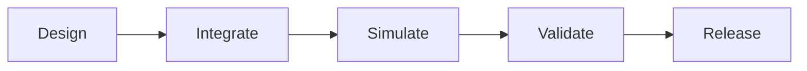
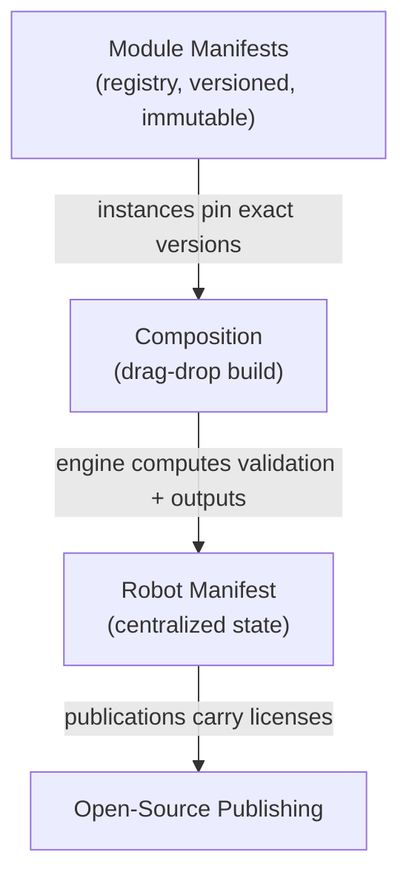

# MERLIN

**M**odular **E**nvironment for **R**obot **L**ifecycle **IN**tegration

> One centralized, versioned state of the robot — from CAD to open-source release.

`status: research & design` · `schemas: draft 2020-12, validated` · `platform: web + git-native backend`

---

## The Problem

Building a robot today means juggling disconnected tools: SolidWorks for mechanical design, Altium for electronics, ROS 2 and its frameworks for software, Gazebo/RViz/MoveIt/Unity for simulation, and spreadsheets or lab systems for material tests. There is no shared state between them — traceability from a failed specimen back to the CAD revision that produced it, or from a sim regression back to a PCB change, is manual guesswork.

## What MERLIN Is

MERLIN is a centralized platform for the **full robot lifecycle**. Every robot lives in a repository that holds a versioned **Robot Manifest** — the single source of truth linking mechanical, electrical, software, simulation, and testing artifacts. Native files stay canonical (SolidWorks, Altium); web-ready derivatives (STEP, glTF, Gerber, BOM JSON) are generated alongside them.



### Core capabilities

| Capability | What it means |
|---|---|
| **Centralized robot state** | A versioned Robot Manifest (YAML/JSON) references every artifact across every domain, with a typed `links[]` traceability graph |
| **Mechanical** | SolidWorks integration (Document Manager API + headless conversion), STEP/glTF/STL derivatives for the browser |
| **Electronics** | Altium projects in native git, Gerber/BOM/netlist outputs, tracespace-based web viewer |
| **Materials & testing** | Material → batch → specimen → test → result chain, with statistics computed on query |
| **Software** | ROS 2 (colcon) builds, CI pipelines, commit-level traceability |
| **Simulation** | GZ Sim + RViz + MoveIt2 + ros2_control in containers, streamed to the browser (Foxglove/noVNC), MCAP recordings as evidence |
| **Modular drag-and-drop builder** | Prebuilt modules — each bundling mechanics + electronics + software with typed interfaces — snapped together with live compatibility validation |
| **Open-source publishing** | Per-artifact licensing (CERN-OHL-P-2.0 hardware, MIT software, CC-BY-SA docs), license-intersection checks, OSHWA certification flow |

---

## The Schema Family

Three JSON Schemas (draft 2020-12) form the platform's data contract. They cross-reference: compositions pin module versions from the registry; robot manifests consume both.

| Schema | Purpose | Key idea |
|---|---|---|
| [`schemas/robot-manifest.schema.json`](schemas/robot-manifest.schema.json) | The robot's central state | Native + generated derivatives per artifact; typed cross-domain `links[]`; public ⇒ licenses required |
| [`schemas/module-manifest.schema.json`](schemas/module-manifest.schema.json) | A self-contained module bundle (HEBI/ODRI-style) | Typed interfaces in 3 domains — bolt patterns & load ratings, buses & power ports, ROS 2 topics & xacro macros |
| [`schemas/composition.schema.json`](schemas/composition.schema.json) | A modular build made of module instances | Authored sections (instances, mates, wiring) vs computed sections (7 named validation checks, outputs, license report) |



The seven composition checks: `mate_matching`, `load_rating`, `collision`, `power_budget`, `bus_config`, `software_interfaces`, `xacro_compile`.

### Examples in this repo

| Example | Demonstrates |
|---|---|
| `examples/quadruped.robot.manifest.json` | A full 12-DoF quadruped: 8 actuator instances, batteries, Gazebo worlds, material tests, publication block |
| `examples/odri-actuator-60.module.manifest.json` | A full-featured actuator: CAN-FD bus, flange + bracket interfaces, ROS 2 node, xacro macro, substitutes |
| `examples/tube-link-300.module.manifest.json` | A passive structural link (no electronics) |
| `examples/battery-pack-48v.module.manifest.json` | A power module with BMS node and node-id ranges |
| `examples/chassis-plate.module.manifest.json` | A structure module providing mounting interfaces |
| `examples/mini-leg.composition.json` | A working 4-instance leg segment — 3 mates, 2 wires, one legitimate warning (CAN vs CAN-FD) proving the warn path |

---

## Repository Structure

```
├── README.md                  ← you are here
├── Project-Report.md          # 11-section academic report (DFD, UML, ER diagram, references)
├── PRD.md                     # 9 epics, ~30 user stories, M0–M9 Gantt roadmap, KPIs, risks
├── Project-Mindmap.md         # Mermaid mindmap + XMind-importable tree
├── Frontend-Design.md         # design tokens, IA/routes, screen specs, component inventory
├── Backend-System-Design.md   # git-native architecture, services, DDL, API, job system, sim plane
├── schemas/                   # the three JSON Schemas (draft 2020-12)
└── examples/                   # validated example documents for all three schemas
```

## Validate the Schemas and Examples

```bash
python -m pip install --user jsonschema

python - <<'EOF'
import json, jsonschema
for schema_file, example in [
    ("schemas/robot-manifest.schema.json",     "examples/quadruped.robot.manifest.json"),
    ("schemas/module-manifest.schema.json",    "examples/odri-actuator-60.module.manifest.json"),
    ("schemas/composition.schema.json",       "examples/mini-leg.composition.json"),
]:
    schema = json.load(open(schema_file))
    jsonschema.validate(json.load(open(example)), schema)
    print(f"{example}: VALID")
EOF
```

All three schemas pass: schema self-checks, positive example validation, negative-test suites, and engine-style referential integrity (module resolution, parent-graph connectivity, mate/port resolution, validation-status consistency).

---

## Documentation Index

| Document | Start here if you want… |
|---|---|
| [`Project-Report.md`](Project-Report.md) | The full problem statement, literature survey, architecture, database design |
| [`PRD.md`](PRD.md) | Requirements, epics, user stories, priorities, the M0–M9 roadmap |
| [`Project-Mindmap.md`](Project-Mindmap.md) | A one-glance map of the whole platform |
| [`Frontend-Design.md`](Frontend-Design.md) | Screens, components, design tokens, UI ↔ schema bindings |
| [`Backend-System-Design.md`](Backend-System-Design.md) | Git-native storage model, API, async jobs, simulation & CAD/EDA planes |

## Roadmap (summary)

| Phase | Scope |
|---|---|
| **M0** | Foundations — schemas, repo model, CI scaffolding |
| **M1** | Core — robots, manifests, versions, activity timeline |
| **M2** | Software DevOps — builds, commits, test-run ingestion |
| **M3** | Modular Builder — module registry, composition engine, live validation |
| **M4–M5** | Mechanical & Electrical — SolidWorks/Altium workstation integration, derivatives |
| **M6** | Materials — test data ingestion and qualification |
| **M7** | Simulation — GPU pool, GZ Sim sessions, browser streaming |
| **M8** | Publishing — license engine, OSHWA, marketplace, open-source space |
| **M9** | Hardening — HA, load tests, multi-workstation fleets |

See [`PRD.md`](PRD.md) for the full breakdown, KPIs, and risk matrix.

## Status

Research and design phase (September 2026). Market research confirmed the gap: the "GitHub for complete robots" position is open — Wikifactory is dead, git-for-hardware startups pivoted, and enterprise PLM is locked behind expensive licenses. The three schemas and this document set are the first implementation-ready deliverables.

**Open decisions:** product vs. internal tool · team size · SolidWorks/Altium seat availability · GPU budget · pricing model.

## Licensing Plan

Per-artifact licensing is the platform default: **CERN-OHL-P-2.0** for hardware, **MIT** for software, **CC-BY-SA-4.0** for documentation — with license-intersection warnings surfaced whenever modules with conflicting licenses are composed. Platform code license: TBD.
